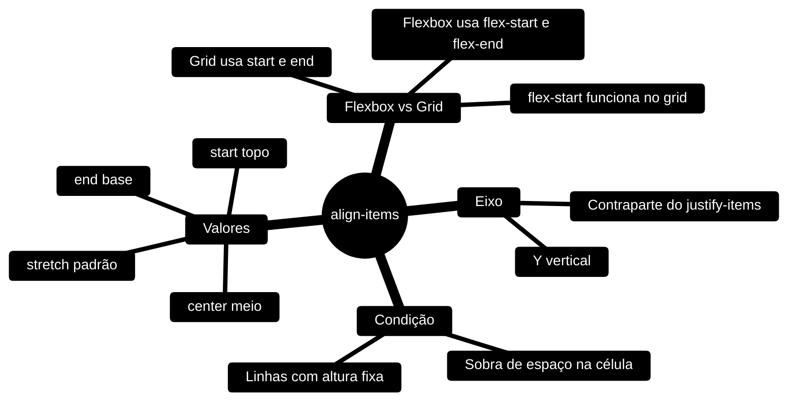

# Grid Layout: `align-items`

## Índice

1. [O que é](#o-que-é)
2. [Sintaxe](#sintaxe)
3. [Quando funciona](#quando-funciona)
4. [Valores](#valores)
5. [Grid vs Flexbox](#grid-vs-flexbox)
6. [Mapa mental](#mapa-mental)
7. [Revisão Rápida](#revisão-rápida)
8. [Referências oficiais](#referências-oficiais)

---

## O que é

A propriedade `align-items` define como os **itens de um grid** são alinhados no **eixo de bloco** (eixo Y, na vertical) dentro da própria **área** onde estão posicionados: a célula, ou o conjunto de células que o item ocupa.

Ela é a contraparte vertical do `justify-items`, que faz o mesmo trabalho no eixo horizontal (eixo X).

| Propriedade | Eixo | Direção em idiomas escritos da esquerda para a direita |
|---|---|---|
| `justify-items` | Eixo X (inline) | Horizontal |
| `align-items` | Eixo Y (block) | Vertical |

> 💡 **Visão de carreira:** dominar o alinhamento nos dois eixos é o que separa quem "chuta valores" de quem constrói layouts previsíveis. Em code review, saber explicar *por que* um item não alinhou é muito valorizado.

---

## Sintaxe

A propriedade é declarada **no contêiner** (o elemento com `display: grid`), e não nos itens.

```css
align-items: start;
```

| Parte | Exemplo | Função |
|---|---|---|
| Propriedade | `align-items` | Define o alinhamento vertical dos itens na célula |
| Valor | `start` | Posição escolhida (início, fim, centro ou esticado) |
| Onde aplicar | Contêiner (`display: grid`) | Afeta todos os itens filhos diretos |

---

## Quando funciona

O `align-items` só tem efeito visível quando **sobra espaço vertical** na área do item. Ou seja, a linha precisa ser mais alta do que o conteúdo do item.

Se a altura da linha for definida pelo próprio conteúdo (`auto`), a linha tem a altura do maior item dela, e os itens menores não têm espaço para se mover.

Por isso, nos exemplos desta página, as linhas têm altura fixa:

```css
grid-template-columns: 1fr 1fr 1fr;
```

```css
grid-template-rows: 100px 100px;
```

Com linhas de `100px`, cada célula tem 100px de altura. Se o item for menor que isso, o `align-items` passa a fazer diferença.

### Estrutura base dos exemplos

```html
<div class="container">
  <div class="item">1</div>
  <div class="item">2</div>
  <div class="item">3</div>
  <div class="item">4</div>
  <div class="item">5</div>
  <div class="item">6</div>
</div>
```

```css
.container {
  display: grid;
  grid-template-columns: 1fr 1fr 1fr;
  grid-template-rows: 100px 100px;
}
```

> ⚠️ Para o `stretch` ter efeito, o item **não pode ter altura definida** (`height` diferente de `auto`). Se tiver, o item mantém a altura declarada.

---

## Valores

### `stretch` (padrão)

Estica o item para ocupar **toda a altura da célula**, desde que o item tenha `height: auto`. É o comportamento padrão (`normal` se comporta como `stretch` em itens de grid).

```css
align-items: stretch;
```

### `start`

Alinha os itens ao **topo** da célula.

```css
align-items: start;
```

### `end`

Alinha os itens à **base** da célula.

```css
align-items: end;
```

### `center`

Centraliza os itens **verticalmente** na célula.

```css
align-items: center;
```

### Comparativo visual (linha de 100px, item cujo conteúdo ocupa 40px)

| Valor | Posição do item na célula | Altura final do item |
|---|---|---|
| `stretch` | Preenche tudo | 100px (esticado, com `height: auto`) |
| `start` | Colado no topo | 40px |
| `center` | No meio | 40px |
| `end` | Colado na base | 40px |

> Se o item tiver `height: 40px` declarado, o `stretch` não o estica: ele permanece com 40px, colado no topo.

### Exemplo completo

```css
.container {
  display: grid;
  grid-template-columns: 1fr 1fr 1fr;
  grid-template-rows: 100px 100px;
  align-items: center;
}
```

```css
.item {
  height: 40px;
}
```

Resultado: os seis itens, com 40px de altura, ficam centralizados verticalmente dentro de cada linha de 100px.

---

## Grid vs Flexbox

O `align-items` é **a mesma propriedade** nos dois modelos de layout, mas os valores de posição têm nomes diferentes por convenção:

| Modelo | Início | Fim |
|---|---|---|
| Grid | `start` | `end` |
| Flexbox | `flex-start` | `flex-end` |

Segundo a especificação (CSS Box Alignment) e a documentação da MDN, os valores `flex-start` e `flex-end` **também são aceitos em um grid**. Nesse contexto, eles se comportam como `start` e `end`.

Isso explica por que o editor pode sugerir `flex-start` ao digitar em um contêiner `display: grid`.

```css
align-items: flex-start;
```

> ✅ **Boa prática:** use `start` e `end` em grid, e `flex-start` e `flex-end` em flexbox. Isso deixa claro para quem lê o código qual modelo de layout está em uso.

---

## Mapa mental



---

## Revisão Rápida

| Conceito | Resumo |
|---|---|
| **O que faz** | Alinha os itens do grid no eixo Y (vertical) dentro da área que ocupam |
| **Onde se aplica** | No contêiner com `display: grid` |
| **Valor padrão** | `normal`, que se comporta como `stretch` |
| **Quando tem efeito** | Só quando a área do item é maior que o conteúdo dele |
| **`stretch`** | Estica o item até preencher a altura da célula (se `height: auto`) |
| **`start`** | Alinha ao topo |
| **`end`** | Alinha à base |
| **`center`** | Centraliza verticalmente |
| **Grid vs Flexbox** | Grid usa `start`/`end`; Flexbox usa `flex-start`/`flex-end` |
| **Par horizontal** | `justify-items` faz o mesmo no eixo X |

---

## Referências oficiais

- [MDN: align-items](https://developer.mozilla.org/pt-BR/docs/Web/CSS/align-items)
- [MDN: Alinhamento de caixas em grid layout](https://developer.mozilla.org/pt-BR/docs/Web/CSS/CSS_grid_layout/Box_alignment_in_grid_layout)
- [W3C: CSS Box Alignment Module Level 3](https://www.w3.org/TR/css-align-3/)

---
**Gabriel Felipe de Oliveira Rateiro** - [GitHub](https://github.com/gabrielfelipeoliveira55){:target="_blank"}