# CSS Grid Layout — `place-self`

> **Em uma frase:** `place-self` decide **onde um único item fica dentro do espaço que o Grid reservou para ele**, nos dois sentidos ao mesmo tempo (vertical e horizontal, em uma escrita tradicional).

## Índice

1. [O que é o `place-self` e para que ele serve?](#1-o-que-é-o-place-self-e-para-que-ele-serve)
2. [Sintaxe](#2-sintaxe)
3. [Lista de possíveis valores](#3-lista-de-possíveis-valores)
   - [3.1 Sintaxe formal e lista completa](#31-sintaxe-formal-e-lista-completa)
   - [3.2 Valores agrupados por tipo](#32-valores-agrupados-por-tipo)
   - [3.3 O que cada valor altera visualmente](#33-o-que-cada-valor-altera-visualmente)
   - [3.4 Laboratório para testar todos os valores](#34-laboratório-para-testar-todos-os-valores)
4. [Os valores, um por um](#4-os-valores-um-por-um)
   - [4.1 `auto`](#41-auto)
   - [4.2 `normal`](#42-normal)
   - [4.3 `stretch`](#43-stretch)
   - [4.4 `start`](#44-start)
   - [4.5 `end`](#45-end)
   - [4.6 `center`](#46-center)
   - [4.7 Combinando valores diferentes em cada eixo](#47-combinando-valores-diferentes-em-cada-eixo)
   - [4.8 `self-start` e `self-end`](#48-self-start-e-self-end)
   - [4.9 `left` e `right`](#49-left-e-right)
   - [4.10 `baseline`, `first baseline` e `last baseline`](#410-baseline-first-baseline-e-last-baseline)
   - [4.11 `safe` e `unsafe`](#411-safe-e-unsafe)
   - [4.12 `anchor-center`](#412-anchor-center)
   - [4.13 Valores globais](#413-valores-globais)
5. [Exemplos de layouts e inspirações](#5-exemplos-de-layouts-e-inspirações)
   - [5.1 Card de produto com botão no canto](#51-card-de-produto-com-botão-no-canto)
   - [5.2 Hero com conteúdo centralizado](#52-hero-com-conteúdo-centralizado)
   - [5.3 Barra de navegação com três zonas](#53-barra-de-navegação-com-três-zonas)
   - [5.4 Formulário com rótulos alinhados](#54-formulário-com-rótulos-alinhados)
   - [5.5 Foto com selo no canto](#55-foto-com-selo-no-canto)
   - [5.6 Painel de métricas](#56-painel-de-métricas)
   - [5.7 Regra geral e exceção](#57-regra-geral-e-exceção)
   - [5.8 Item que ocupa várias células](#58-item-que-ocupa-várias-células)
   - [5.9 Legenda sobre a imagem](#59-legenda-sobre-a-imagem)
   - [5.10 Rodapé com duas pontas](#510-rodapé-com-duas-pontas)
   - [5.11 Modal centralizado](#511-modal-centralizado)
   - [5.12 Plano de preços com selo](#512-plano-de-preços-com-selo)
   - [5.13 Linha com ícone e texto](#513-linha-com-ícone-e-texto)
   - [5.14 Preços alinhados pela baseline](#514-preços-alinhados-pela-baseline)
   - [5.15 Menu lateral com botão no rodapé](#515-menu-lateral-com-botão-no-rodapé)
   - [5.16 Grade de ícones responsiva](#516-grade-de-ícones-responsiva)
6. [Principais erros e confusões](#6-principais-erros-e-confusões)
7. [Tabela de fixação](#7-tabela-de-fixação)
8. [Resumo](#8-resumo)
9. [Referências](#9-referências)

---

## 1. O que é o `place-self` e para que ele serve?

O `place-self` é uma propriedade CSS aplicada **em um item do Grid** (e não no container). Ela serve para alinhar esse item dentro da área que ele ocupa, tanto no sentido vertical quanto no horizontal, usando uma única linha de código.

```css
.item {
  place-self: center;
}
```

Esse código coloca o item no centro da área dele. Para entender por que isso funciona, vamos por partes.

### 1.1 Primeiro: o que é uma Grid Area?

Quando você cria um Grid, o navegador divide o espaço em **linhas** (rows) e **colunas** (columns). Cada item do Grid recebe um pedaço desse espaço, chamado **Grid Area** (área do Grid).

Uma Grid Area pode ser:

- **uma única célula**, quando o item ocupa uma linha e uma coluna;
- **várias células juntas**, quando o item usa `span`, `grid-column`, `grid-row` ou `grid-area`.

```css
.container {
  display: grid;
  grid-template-columns: 1fr 1fr;
  grid-template-rows: 150px 150px;
}
```

Esse código cria 2 colunas e 2 linhas, ou seja, 4 células. Cada item, por padrão, ocupa uma célula.

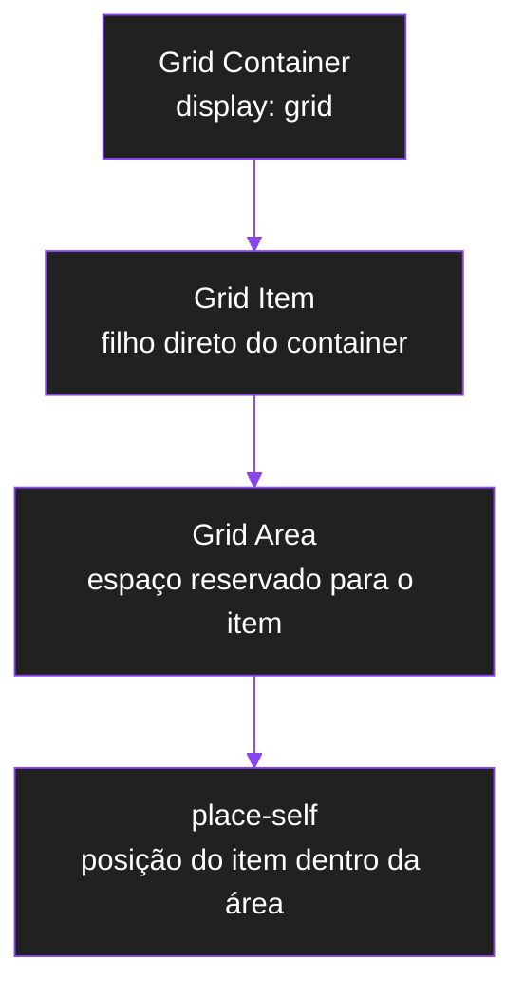

### 1.2 O que significa alinhar "dentro da área"?

O item e a Grid Area **nem sempre têm o mesmo tamanho**. A área pode ser grande, e o conteúdo do item pode ser pequeno. Quando sobra espaço, surge a pergunta: **onde o item fica dentro dessa área?**

```text
┌──────────────────────────────┐
│          GRID AREA           │
│                              │
│      ┌──────────────┐        │
│      │     ITEM     │        │
│      └──────────────┘        │
│                              │
└──────────────────────────────┘
```

É essa pergunta que o `place-self` responde. Ele **não muda a área** e **não muda a célula**. Ele só muda a posição do item dentro da área.

### 1.3 O que é um shorthand?

`place-self` é um **shorthand**, ou seja, uma forma abreviada de escrever duas propriedades de uma vez só:

| Propriedade | O que controla |
| --- | --- |
| `align-self` | o alinhamento do item no **eixo block** (em escrita horizontal, o vertical) |
| `justify-self` | o alinhamento do item no **eixo inline** (em escrita horizontal, o horizontal) |

Portanto:

```css
.item {
  place-self: center end;
}
```

é o mesmo que:

```css
.item {
  align-self: center;
  justify-self: end;
}
```

### 1.4 O que são o eixo block e o eixo inline?

O CSS não pensa apenas em "horizontal" e "vertical", porque existem idiomas escritos em outras direções (como o japonês, que pode ser escrito na vertical). Por isso, ele usa dois nomes:

- **Eixo inline:** a direção em que o texto corre. Em português, da esquerda para a direita.
- **Eixo block:** a direção em que os blocos se empilham. Em português, de cima para baixo.

```text
              EIXO BLOCK
                  ↑
                  │
   EIXO INLINE ←──┼──→
                  │
                  ↓
```

Em um site em português, você pode ler **block = vertical** e **inline = horizontal**. Só lembre que essa leitura vale para a escrita horizontal tradicional.

### 1.5 Por trás dos panos: como o navegador decide a posição

Quando a página carrega, o navegador segue estes passos para cada item do Grid:

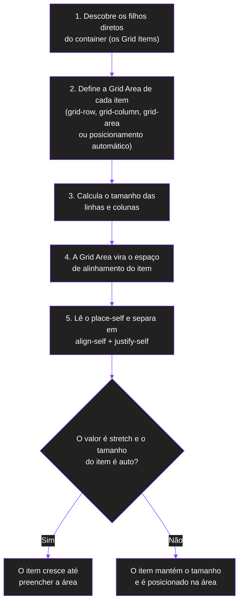

Pontos importantes desse processo:

- O alinhamento só acontece **depois** que a área já foi definida. Por isso o `place-self` nunca decide em qual célula o item está.
- Se você não escrever `place-self`, o valor inicial é `auto`. Com `auto`, o item **herda a regra do container**, ou seja, usa o `align-items` e o `justify-items` dele (que são resumidos em `place-items`).
- O valor padrão dessas regras do container é `normal`, que no Grid se comporta como `stretch`. É por isso que, sem nenhuma configuração, os itens costumam ocupar a célula inteira.

### 1.6 Regra geral + exceção

Essa relação entre container e item é o jeito mais comum de usar o `place-self`:

```text
place-items  (no container) → regra geral para TODOS os itens
place-self   (no item)      → exceção para UM item
```

```css
.container {
  display: grid;
  place-items: center; /* todos centralizados */
}

.destaque {
  place-self: end; /* só este item vai para o canto */
}
```

---

## 2. Sintaxe

```css
.item {
  place-self: <align-self> <justify-self>;
}
```

Segundo a MDN, a forma completa é:

```text
place-self: auto | <align-self> <justify-self>?
```

O `?` indica que o segundo valor é opcional.

### 2.1 A ordem dos valores

O **primeiro valor** controla o `align-self` (eixo block) e o **segundo** controla o `justify-self` (eixo inline).

```text
place-self:   center     end
                │         │
                ▼         ▼
          align-self  justify-self
         (eixo block) (eixo inline)
```

> **Dica para não esquecer:** na ordem alfabética, `align` vem antes de `justify`. O `place-self` segue essa mesma ordem.

### 2.2 O que acontece com um valor só?

Se você escrever apenas um valor, o navegador **copia esse valor para os dois eixos**:

```css
.item {
  place-self: center;
}
```

equivale a:

```css
.item {
  align-self: center;
  justify-self: center;
}
```

### 2.3 O que acontece com dois valores?

Cada eixo recebe o seu valor:

```css
.item {
  place-self: start end;
}
```

```text
align-self:   start  → vai para o início do eixo block (em cima)
justify-self: end    → vai para o final do eixo inline (à direita)
```

```text
┌──────────────────────────────┐
│                    ┌───────┐ │
│                    │ ITEM  │ │
│                    └───────┘ │
│                              │
│                              │
└──────────────────────────────┘
```

### 2.4 Como mexer em um eixo só?

Use o valor `auto` no eixo que você não quer alterar:

```css
.item {
  place-self: center auto;
}
```

Aqui o `align-self` vira `center`, e o `justify-self` continua seguindo a regra do container (`auto`).

### 2.5 Os valores `left` e `right`

Os valores `left` e `right` só existem para o **eixo inline** (`justify-self`). Por isso, eles só podem ficar na **segunda posição**:

```css
.item {
  place-self: start left; /* válido */
}
```

```css
.item {
  place-self: left; /* inválido: o primeiro valor também vai para o align-self, que não aceita left */
}
```

---

## 3. Lista de possíveis valores

Esta seção responde a três perguntas: **quais valores o `place-self` aceita**, **como eles se agrupam** e **o que cada um muda (ou não muda) visualmente no item**.

### 3.1 Sintaxe formal e lista completa

A MDN descreve a sintaxe formal assim:

```text
place-self = auto | <align-self> <justify-self>?
```

Cada um dos dois valores segue a sintaxe da propriedade correspondente:

```text
align-self   = auto | normal | stretch | <baseline-position>
             | <overflow-position>? <self-position>
             | anchor-center

justify-self = auto | normal | stretch | <baseline-position>
             | <overflow-position>? [ <self-position> | left | right ]
             | anchor-center
```

Os "nomes entre `<` e `>`" são grupos de valores:

```text
<self-position>      = center | start | end | self-start | self-end
                     | flex-start | flex-end

<baseline-position>  = [ first | last ]? baseline

<overflow-position>  = unsafe | safe
```

Colocando tudo em uma lista simples, **estes são todos os valores que o `place-self` aceita**:

| # | Valor | Aceito em qual posição? |
| --- | --- | --- |
| 1 | `auto` | 1ª e 2ª |
| 2 | `normal` | 1ª e 2ª |
| 3 | `stretch` | 1ª e 2ª |
| 4 | `start` | 1ª e 2ª |
| 5 | `end` | 1ª e 2ª |
| 6 | `center` | 1ª e 2ª |
| 7 | `self-start` | 1ª e 2ª |
| 8 | `self-end` | 1ª e 2ª |
| 9 | `flex-start` | 1ª e 2ª |
| 10 | `flex-end` | 1ª e 2ª |
| 11 | `left` | **somente a 2ª** |
| 12 | `right` | **somente a 2ª** |
| 13 | `baseline` | 1ª e 2ª |
| 14 | `first baseline` | 1ª e 2ª |
| 15 | `last baseline` | 1ª e 2ª |
| 16 | `safe` + posição (`safe center`, `safe end`, ...) | 1ª e 2ª |
| 17 | `unsafe` + posição (`unsafe center`, `unsafe end`, ...) | 1ª e 2ª |
| 18 | `anchor-center` | 1ª e 2ª |
| 19 | valores globais: `inherit`, `initial`, `unset`, `revert`, `revert-layer` | declaração inteira |

> **Atenção:** os valores globais (linha 19) valem para a propriedade toda, e não para um eixo. Por isso você escreve `place-self: initial;`, e nunca `place-self: initial center;`.

### 3.2 Valores agrupados por tipo

Para decorar, é mais fácil pensar em grupos:

| Grupo | Valores | Ideia |
| --- | --- | --- |
| **Automáticos** | `auto`, `normal` | "o navegador decide, seguindo a regra do container ou do layout" |
| **Preenchimento** | `stretch` | "ocupe a área" |
| **Posições** | `start`, `end`, `center` | "vá para o início, o final ou o meio" |
| **Posições relativas ao item** | `self-start`, `self-end` | "início/final segundo o modo de escrita do próprio item" |
| **Nomes do Flexbox** | `flex-start`, `flex-end` | "no Grid, são apelidos de `start` e `end`" |
| **Posições físicas** | `left`, `right` | "esquerda/direita da tela" (só na 2ª posição) |
| **Linha de base** | `baseline`, `first baseline`, `last baseline` | "alinhe pela linha em que o texto se apoia" |
| **Segurança contra overflow** | `safe`, `unsafe` | "o que fazer se o item for maior que a área" |
| **Âncora** | `anchor-center` | "centralize na âncora" (recurso novo e específico) |
| **Globais** | `inherit`, `initial`, `unset`, `revert`, `revert-layer` | "escolha de onde o valor vem" |

### 3.3 O que cada valor altera visualmente

Nem todo valor produz uma mudança visível. Alguns são **apelidos** de outros, e outros só **funcionam em situações específicas**. A tabela abaixo mostra, para cada valor, **se ele muda a posição do item, se muda o tamanho e quando o efeito aparece**.

| Valor | Muda a posição? | Muda o tamanho? | Quando o efeito aparece |
| --- | --- | --- | --- |
| `auto` | depende do container | depende do container | segue o `place-items`. Sem `place-items`, age como `stretch` |
| `normal` | não | **sim**: o item cresce | no Grid, age como `stretch`. Itens com proporção própria (imagens) agem como `start` |
| `stretch` | não | **sim**: o item cresce até preencher a área | só em tamanhos `auto`. Com `width`/`height` definidos, não há efeito de tamanho e o item fica como `start` |
| `start` | **sim**: vai para o início | **sim**: se estava esticado, encolhe para o tamanho do conteúdo | só se nota quando sobra espaço na área |
| `end` | **sim**: vai para o final | **sim**: encolhe para o tamanho do conteúdo | só se nota quando sobra espaço na área |
| `center` | **sim**: vai para o meio | **sim**: encolhe para o tamanho do conteúdo | só se nota quando sobra espaço na área |
| `self-start` | igual a `start` | igual a `start` | só difere de `start` se o item tiver um modo de escrita diferente do container |
| `self-end` | igual a `end` | igual a `end` | só difere de `end` se o item tiver um modo de escrita diferente do container |
| `flex-start` | igual a `start` | igual a `start` | **nunca** difere de `start` no Grid |
| `flex-end` | igual a `end` | igual a `end` | **nunca** difere de `end` no Grid |
| `left` | **sim** (eixo inline) | encolhe, como `start` | só na 2ª posição. Difere de `start` em idiomas da direita para a esquerda |
| `right` | **sim** (eixo inline) | encolhe, como `end` | só na 2ª posição. Difere de `end` em idiomas da direita para a esquerda |
| `baseline` | **sim**: o item sobe ou desce para alinhar a linha de base | não estica | itens na **mesma linha (row)** com textos diferentes. O efeito é no eixo block |
| `first baseline` | igual a `baseline` | igual a `baseline` | só difere se houver textos com várias linhas |
| `last baseline` | **sim**: alinha pela última linha de texto | não estica | só difere de `first baseline` com várias linhas de texto |
| `safe` + posição | só se o item for maior que a área | não | **sem overflow, não muda nada** em relação à posição sem `safe` |
| `unsafe` + posição | só se o item for maior que a área | não | **sem overflow, não muda nada** em relação à posição sem `unsafe` |
| `anchor-center` | normalmente age como `center` em itens do Grid | igual a `center` | efeito próprio apenas em elementos posicionados por âncora |
| `inherit` | sem efeito próprio | sem efeito próprio | copia o valor do elemento pai |
| `initial` | volta a `auto` | volta a `auto` | restaura o valor inicial |
| `unset` | volta a `auto` | volta a `auto` | como a propriedade não é herdada, equivale a `initial` |
| `revert` / `revert-layer` | sem efeito próprio | sem efeito próprio | desfazem declarações de uma origem ou camada da cascata |

Um jeito rápido de lembrar quando o `place-self` **não** muda nada que você veja:

```text
1. Não sobra espaço na área          → nada tem para onde ir
2. O valor é apelido de outro        → flex-start, flex-end, self-start, self-end
3. O item não é um Grid Item         → o Grid não alinha elementos fora dele
4. O item tem margin: auto           → a margem consome o espaço antes
5. O item está sem overflow          → safe e unsafe ficam iguais
```

### 3.4 Laboratório para testar todos os valores

Cole este código em uma página e veja cada valor em ação. Cada caixa tracejada é a **Grid Area**, e o bloco roxo é o **item**.

```html
<div class="lab">
  <div class="area"><span class="item s-start">start</span></div>
  <div class="area"><span class="item s-end">end</span></div>
  <div class="area"><span class="item s-center">center</span></div>
  <div class="area"><span class="item s-stretch">stretch</span></div>
  <div class="area"><span class="item s-start-end">start end</span></div>
  <div class="area"><span class="item s-end-start">end start</span></div>
  <div class="area"><span class="item s-center-start">center start</span></div>
  <div class="area"><span class="item s-start-center">start center</span></div>
  <div class="area"><span class="item s-end-stretch">end stretch</span></div>
</div>
```

```css
.lab {
  display: grid;
  grid-template-columns: repeat(3, 180px);
  grid-auto-rows: 120px;
  gap: 12px;
}

.area {
  display: grid;
  border: 2px dashed #8844ee;
}

.item {
  background: #8844ee;
  color: #ffffff;
  padding: 8px;
}
```

```css
.s-start        { place-self: start; }
.s-end          { place-self: end; }
.s-center       { place-self: center; }
.s-stretch      { place-self: stretch; }
.s-start-end    { place-self: start end; }
.s-end-start    { place-self: end start; }
.s-center-start { place-self: center start; }
.s-start-center { place-self: start center; }
.s-end-stretch  { place-self: end stretch; }
```

Como o laboratório funciona:

- `.lab` é um Grid que organiza as nove caixas.
- Cada `.area` é **ao mesmo tempo item do `.lab` e container de um outro Grid**. Um elemento pode ter os dois papéis.
- Dentro de cada `.area`, o `.item` é o Grid Item que recebe o `place-self`.
- A borda tracejada deixa visível a Grid Area. Tente trocar os valores e observar o que se move e o que cresce.

---

## 4. Os valores, um por um

Nos desenhos abaixo, a caixa grande é a **Grid Area**, e a caixa menor é o **item**. Cada valor é explicado em quatro partes:

- **O que é:** a definição simples do valor.
- **O que muda visualmente:** o que você vê na tela.
- **O que não muda:** o que continua igual.
- **Quando você percebe:** em que situação o efeito aparece.

### 4.1 `auto`

```css
.item {
  place-self: auto;
}
```

**O que é:** o valor inicial. Significa "não tenho regra própria, use a do container".

**O que muda visualmente:** depende do container. O item passa a obedecer ao `place-items` (ou ao `align-items` e `justify-items`) do pai.

```text
container: place-items: center
item:      place-self: auto
resultado: o item fica centralizado
```

**O que não muda:** a Grid Area do item.

**Quando você percebe:** quando o container define `place-items` e um item específico precisa **voltar** a segui-lo, por exemplo depois de uma regra mais específica ter dado a ele outro `place-self`. Se o container não definir nada, o `place-items` é `normal`, e o item se comporta como `stretch` (seção 4.3).

### 4.2 `normal`

```css
.item {
  place-self: normal;
}
```

**O que é:** "comportamento padrão do tipo de layout". No Grid, isso significa:

- em itens comuns, age como `stretch`;
- em itens com **proporção própria** (imagens, por exemplo), age como `start`, para não distorcer.

**O que muda visualmente:** o item cresce para preencher a área (como `stretch`), ou fica no início, no caso de uma imagem.

```text
item comum              imagem (proporção própria)
┌───────────────┐       ┌───────────────┐
│ ┌───────────┐ │       │ ┌─────┐       │
│ │   ITEM    │ │       │ │ IMG │       │
│ └───────────┘ │       │ └─────┘       │
└───────────────┘       └───────────────┘
 age como stretch        age como start
```

**O que não muda:** a Grid Area.

**Quando você percebe:** é o comportamento que você vê quando não escreve nada. Raramente é necessário digitar `normal`.

### 4.3 `stretch`

```css
.item {
  place-self: stretch;
}
```

**O que é:** "preencha a área".

**O que muda visualmente:** o item **cresce** até ocupar a área nos dois eixos, descontadas as margens dele.

```text
ANTES (item pequeno)          DEPOIS (stretch)
┌──────────────────────┐      ┌──────────────────────┐
│ ┌──────┐             │      │ ┌──────────────────┐ │
│ │ ITEM │             │      │ │                  │ │
│ └──────┘             │      │ │       ITEM       │ │
│                      │      │ │                  │ │
│                      │      │ └──────────────────┘ │
└──────────────────────┘      └──────────────────────┘
```

**O que não muda:** o item não muda de célula, e o conteúdo dele não é esticado (apenas a caixa).

**Quando você percebe:** só quando o tamanho do item, naquele eixo, é `auto`.

- Se o item tem `width: 100px`, ele não é esticado na horizontal.
- Se o item tem `height: 50px`, ele não é esticado na vertical.
- Um `max-width` ou `max-height` limita até onde ele cresce.

Quando o `stretch` não consegue atuar, o item fica posicionado como `start`.

> O `stretch` não é igual a `width: 100%`. O `width: 100%` define um tamanho fixo. O `stretch` usa o espaço livre do alinhamento e respeita os limites do item.

### 4.4 `start`

```css
.item {
  place-self: start;
}
```

**O que é:** "vá para o início".

**O que muda visualmente:** o item vai para o **início de cada eixo**, o canto superior esquerdo em escrita da esquerda para a direita. Além disso, ele **deixa de ser esticado**: passa a ter o tamanho que o conteúdo pede (limitado ao espaço disponível).

```text
┌──────────────────────────────┐
│ ┌───────┐                    │
│ │ ITEM  │                    │
│ └───────┘                    │
│                              │
│                              │
└──────────────────────────────┘
```

**O que não muda:** a Grid Area e a ordem dos itens.

**Quando você percebe:** quando a área é maior que o item. Se a área já tem o tamanho do conteúdo, `start` e `stretch` parecem iguais.

### 4.5 `end`

```css
.item {
  place-self: end;
}
```

**O que é:** "vá para o final".

**O que muda visualmente:** o item vai para o **final de cada eixo**, o canto inferior direito, e passa a ter o tamanho do conteúdo.

```text
┌──────────────────────────────┐
│                              │
│                              │
│                    ┌───────┐ │
│                    │ ITEM  │ │
│                    └───────┘ │
└──────────────────────────────┘
```

**O que não muda:** a Grid Area.

**Quando você percebe:** quando sobra espaço na área.

### 4.6 `center`

```css
.item {
  place-self: center;
}
```

**O que é:** "vá para o meio".

**O que muda visualmente:** o item vai para o **centro da área**, nos dois eixos, e passa a ter o tamanho do conteúdo.

```text
┌──────────────────────────────┐
│                              │
│         ┌───────┐            │
│         │ ITEM  │            │
│         └───────┘            │
│                              │
└──────────────────────────────┘
```

**O que não muda:** a Grid Area. O espaço livre é dividido igualmente entre os dois lados.

**Quando você percebe:** quando sobra espaço na área.

### 4.7 Combinando valores diferentes em cada eixo

Com dois valores, cada combinação leva o item para um ponto diferente da área. O primeiro valor é o eixo block (vertical) e o segundo é o eixo inline (horizontal).

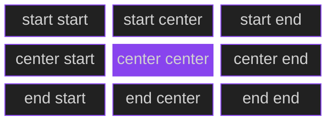

Cada caixa mostra o valor de `place-self` que leva o item para aquela posição da área. O centro (`center center`) é o mesmo que escrever só `place-self: center`.

Há também as combinações com `stretch`, que esticam em um eixo e posicionam no outro:

| Valor | Resultado |
| --- | --- |
| `start stretch` | no topo, ocupando toda a largura |
| `end stretch` | embaixo, ocupando toda a largura |
| `stretch start` | à esquerda, ocupando toda a altura |
| `stretch end` | à direita, ocupando toda a altura |

```text
end stretch                     stretch end
┌──────────────────────┐        ┌──────────────────────┐
│                      │        │                  ┌───┤
│                      │        │                  │   │
│ ┌──────────────────┐ │        │                  │ I │
│ │       ITEM       │ │        │                  │   │
│ └──────────────────┘ │        │                  └───┤
└──────────────────────┘        └──────────────────────┘
```

### 4.8 `self-start` e `self-end`

```css
.item {
  place-self: self-start;
}
```

**O que é:** o mesmo que `start` e `end`, mas medindo o início e o fim **a partir do modo de escrita do próprio item**, e não do container.

```text
start / end
→ seguem o modo de escrita do container

self-start / self-end
→ seguem o modo de escrita do próprio item
```

**O que muda visualmente:** em um layout comum, **nada** em relação a `start` e `end`.

**O que não muda:** a Grid Area.

**Quando você percebe:** apenas quando o item e o container têm direções de escrita diferentes. Um exemplo é um item com `direction: rtl` (da direita para a esquerda) dentro de um container da esquerda para a direita. No dia a dia, você pode ignorá-los.

### 4.9 `left` e `right`

```css
.item {
  place-self: start left;
  place-self: start right;
}
```

**O que é:** valores **físicos** para o eixo inline. `left` é sempre a esquerda da tela e `right` é sempre a direita. Já `start` e `end` são **lógicos**: dependem da direção da escrita.

```text
idioma da esquerda para a direita:   start = esquerda   end = direita
idioma da direita para a esquerda:   start = direita    end = esquerda
left  = esquerda   (sempre)
right = direita    (sempre)
```

**O que muda visualmente:** o item vai para o lado indicado e passa a ter o tamanho do conteúdo.

**O que não muda:** o eixo block. `left` e `right` só afetam o eixo inline, e por isso só podem ficar na **segunda posição**.

**Quando você percebe:** quando o site pode ser exibido em um idioma da direita para a esquerda. Em português, `left` dá o mesmo resultado que `start`, e `right` dá o mesmo que `end`. Para sites que podem ser lidos em árabe ou hebraico, prefira `start` e `end`.

### 4.10 `baseline`, `first baseline` e `last baseline`

```css
.item {
  place-self: baseline start;
}
```

**O que é:** a **baseline** (linha de base) é a linha imaginária sobre a qual o texto "apoia" as letras. O alinhamento por baseline faz textos de tamanhos diferentes ficarem **apoiados na mesma linha**.

**O que muda visualmente:** o item sobe ou desce para que a baseline dele coincida com a dos outros itens que também usam `baseline` **na mesma linha (row)**.

```text
Alinhado pelo topo (start)      Alinhado pela baseline

┌──────┐ ┌────┐                 ┌──────┐
│ Olá  │ │ Oi │                 │ Olá  │ ┌────┐
│      │ └────┘                 │      │ │ Oi │
└──────┘                        └──────┘ └────┘
                                ── as linhas de base se encontram ──
```

As variações:

- **`baseline`** e **`first baseline`** são o mesmo: usam a linha de base da **primeira linha de texto**.
- **`last baseline`** usa a linha de base da **última linha de texto**. Só difere dos outros quando o texto tem várias linhas.

**O que não muda:** o item não é esticado. Se ele não puder ser alinhado por baseline, volta para `start`.

**Quando você percebe:**

- o efeito aparece principalmente no **eixo block**, ou seja, na **primeira posição** do `place-self`;
- no eixo inline (segunda posição), em textos horizontais comuns, o resultado costuma ser o mesmo de `start`;
- o suporte pode variar entre navegadores. Consulte a tabela de compatibilidade da MDN antes de depender dele.

### 4.11 `safe` e `unsafe`

```css
.item {
  place-self: safe center;
  place-self: unsafe center;
}
```

**O que é:** modificadores que você coloca **antes** de uma posição (`start`, `end`, `center` etc.). Eles controlam o que acontece quando o **item é maior que a área** e a posição escolhida o faria sair dela.

- **`safe`:** o navegador usa um alinhamento equivalente a `start`, para que o início do conteúdo não fique cortado.
- **`unsafe`:** o navegador respeita a posição pedida, mesmo que o conteúdo ultrapasse a área.

```text
item maior que a área, com center:

unsafe center                 safe center
  ┌────────────────┐          ┌────────────────┐
┌─┼────── ITEM ────┼─┐        │ ITEM ──────────┼───┐
│ └────────────────┘ │        └────────────────┘   │
└────────────────────┘                             └──
 vaza dos dois lados           vaza só para um lado (o final)
```

**O que muda visualmente:** só muda algo **quando o item é maior que a área**.

**O que não muda:** quando o item cabe na área, `safe center`, `unsafe center` e `center` produzem exatamente o mesmo resultado.

**Quando você percebe:** em itens com conteúdo largo ou alto (textos longos sem quebra, imagens grandes) dentro de áreas pequenas.

### 4.12 `anchor-center`

```css
.item {
  place-self: anchor-center;
}
```

**O que é:** um valor recente, ligado ao **anchor positioning** (posicionamento por âncora, a técnica que prende um elemento a outro, como um tooltip a um botão). Ele centraliza o elemento na âncora dele.

**O que muda visualmente:** em um Grid Item comum, **sem âncora**, a especificação diz que ele se comporta como `center`.

**O que não muda:** nada além disso. Fora do contexto de âncoras, você não ganha nada em usá-lo no lugar de `center`.

**Quando você percebe:** apenas em elementos posicionados por âncora. O suporte nos navegadores ainda é recente, então confira a compatibilidade na MDN.

### 4.13 Valores globais

```css
.item {
  place-self: initial;
}
```

Todo valor de CSS aceita as cinco palavras globais. Elas não alinham nada: elas dizem **de onde o valor vem**.

| Valor | O que faz com o `place-self` |
| --- | --- |
| `inherit` | copia o valor do elemento pai |
| `initial` | volta ao valor inicial, que é `auto` |
| `unset` | como a propriedade não é herdada, equivale a `initial` |
| `revert` | volta ao valor que o navegador (ou o estilo do usuário) definiria |
| `revert-layer` | desfaz o valor definido na camada (`@layer`) atual |

O uso mais comum é `place-self: initial` (ou `auto`) para **desfazer** um alinhamento aplicado por outra regra.

---

## 5. Exemplos de layouts e inspirações

Cada exemplo mostra o **código** e um **diagrama**. Nos diagramas, os blocos roxos destacam o item que usa `place-self`.

### 5.1 Card de produto com botão no canto

O preço fica alinhado à esquerda, e o botão vai para o canto direito.

```css
.card {
  display: grid;
  grid-template-columns: 1fr auto;
  gap: 12px;
}

.card img {
  grid-column: 1 / -1;
}

.card .preco {
  place-self: center start;
}

.card .botao {
  place-self: center end;
}
```

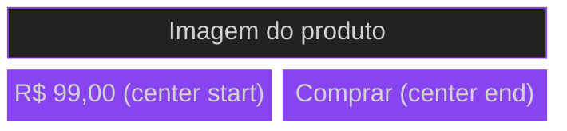

### 5.2 Hero com conteúdo centralizado

```css
.hero {
  display: grid;
  min-height: 100vh;
}

.hero .conteudo {
  place-self: center;
}
```

Aqui o Grid tem uma única linha e uma única coluna, ambas com tamanho `auto`. A linha cresce até preencher os `100vh`, e a Grid Area vira a tela inteira. O `place-self: center` centraliza o conteúdo nessa área.

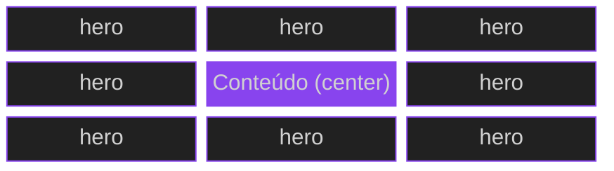

### 5.3 Barra de navegação com três zonas

Logo à esquerda, menu no centro e botão de login à direita.

```css
.navbar {
  display: grid;
  grid-template-columns: 1fr auto 1fr;
}

.navbar .logo {
  place-self: center start;
}

.navbar .menu {
  place-self: center;
}

.navbar .login {
  place-self: center end;
}
```

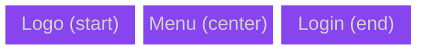

### 5.4 Formulário com rótulos alinhados

```css
.form {
  display: grid;
  grid-template-columns: max-content 1fr;
  gap: 12px 16px;
}

.form label {
  place-self: center end;
}

.form .enviar {
  grid-column: 2;
  place-self: end;
}
```

Os rótulos ficam encostados à direita, perto do campo e centralizados na vertical. Os campos usam o comportamento padrão (`stretch`) e ocupam a largura toda. O botão vai para o canto inferior direito da área dele.

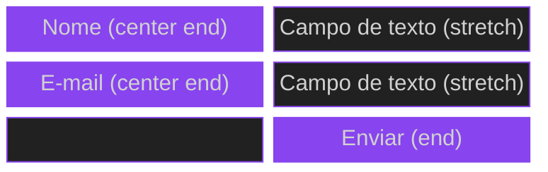

### 5.5 Foto com selo no canto

Para colocar um selo sobre uma imagem, os dois itens ocupam **a mesma célula**, e o selo usa `place-self` para ir ao canto.

```css
.foto {
  display: grid;
}

.foto > * {
  grid-area: 1 / 1;
}

.foto img {
  width: 100%;
}

.foto .selo {
  place-self: start end;
}
```

O `grid-area: 1 / 1` coloca os dois itens na linha 1 e coluna 1. O selo é desenhado por cima, porque vem depois no HTML, e o `start end` o leva para o canto superior direito.

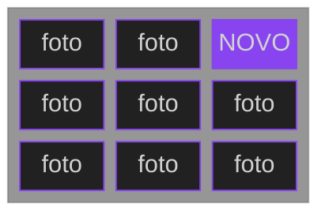

### 5.6 Painel de métricas

Os números ficam centralizados nos cartões, e o gráfico preenche toda a largura.

```css
.painel {
  display: grid;
  grid-template-columns: repeat(3, 1fr);
  grid-auto-rows: 120px;
  gap: 16px;
}

.painel .metrica {
  place-self: center;
}

.painel .grafico {
  grid-column: 1 / -1;
  place-self: stretch;
}
```

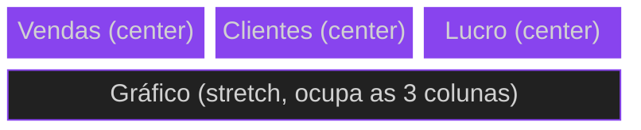

### 5.7 Regra geral e exceção

Todos os itens centralizados, e um deles fugindo da regra.

```css
.galeria {
  display: grid;
  grid-template-columns: repeat(3, 1fr);
  grid-auto-rows: 120px;
  place-items: center;
}

.galeria .especial {
  place-self: end;
}
```

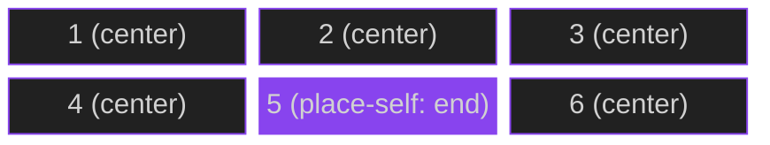

### 5.8 Item que ocupa várias células

O `place-self` considera a **área inteira** do item, e não só uma célula.

```css
.layout {
  display: grid;
  grid-template-columns: repeat(3, 1fr);
  grid-auto-rows: 100px;
}

.destaque {
  grid-column: 1 / 3;
  place-self: center;
}
```


Com `grid-column: 1 / 3`, a área do item tem duas colunas. O centro é calculado **no meio das duas**.

### 5.9 Legenda sobre a imagem

A legenda fica **colada na base** da imagem e **ocupa toda a largura**. É um bom uso de dois valores diferentes: `end` no eixo block e `stretch` no eixo inline.

```css
.figura {
  display: grid;
}

.figura > * {
  grid-area: 1 / 1;
}

.figura img {
  width: 100%;
}

.figura figcaption {
  place-self: end stretch;
  padding: 8px;
  background: rgb(0 0 0 / 0.6);
  color: #ffffff;
}
```

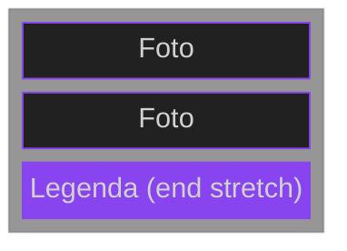

### 5.10 Rodapé com duas pontas

O texto de direitos autorais à esquerda, e as redes sociais à direita.

```css
.rodape {
  display: grid;
  grid-template-columns: 1fr 1fr;
}

.rodape .copy {
  place-self: center start;
}

.rodape .redes {
  place-self: center end;
}
```

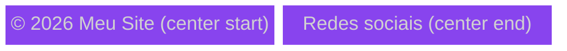

### 5.11 Modal centralizado

O `overlay` cobre a tela inteira, e o modal fica exatamente no centro.

```css
.overlay {
  position: fixed;
  inset: 0;
  display: grid;
  background: rgb(0 0 0 / 0.6);
}

.modal {
  place-self: center;
}
```

O `overlay` é um Grid de uma única célula do tamanho da tela. O `place-self: center` do modal o posiciona no meio dessa célula.

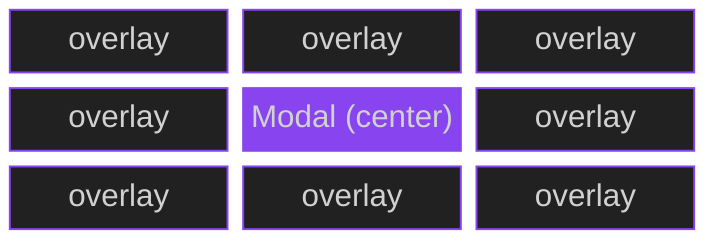

### 5.12 Plano de preços com selo

O selo "Mais popular" fica no topo, centralizado na horizontal.

```css
.plano {
  display: grid;
}

.plano > * {
  grid-area: 1 / 1;
}

.plano .conteudo {
  padding-top: 32px;
}

.plano .selo {
  place-self: start center;
}
```

O `padding-top` do conteúdo abre espaço para o selo não cobrir o texto.

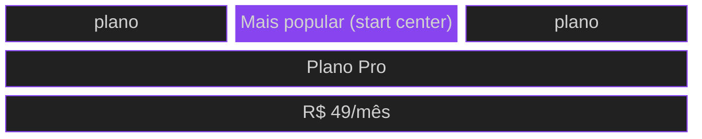

### 5.13 Linha com ícone e texto

O ícone fica centralizado na vertical, enquanto o texto fica alinhado à esquerda.

```css
.linha {
  display: grid;
  grid-template-columns: 48px 1fr;
  gap: 12px;
}

.linha .icone {
  place-self: center;
}

.linha .texto {
  place-self: center start;
}
```

Mesmo que o texto ocupe duas ou três linhas, o ícone continua **no meio da altura** da linha.


### 5.14 Preços alinhados pela baseline

Um preço com números grandes e o símbolo da moeda pequeno ficam **apoiados na mesma linha**.

```html
<div class="preco">
  <span class="moeda">R$</span>
  <span class="valor">99</span>
</div>
```

```css
.preco {
  display: grid;
  grid-template-columns: auto auto;
  justify-content: start;
  gap: 4px;
}

.preco .moeda {
  font-size: 1rem;
  place-self: baseline start;
}

.preco .valor {
  font-size: 3rem;
  place-self: baseline start;
}
```

O primeiro valor (`baseline`) alinha os dois itens pela linha de base no eixo block. O segundo (`start`) encosta cada um no início do eixo inline.

```text
Sem baseline (start)         Com baseline

R$ ┌────┐                     ┌────┐
   │ 99 │                     │ 99 │
   └────┘                  R$ └────┘
                           ↑
                  as duas linhas de base se encontram
```

### 5.15 Menu lateral com botão no rodapé

Os links ficam no topo, e o botão "Sair" desce até o canto inferior esquerdo.

```css
.menu-lateral {
  display: grid;
  grid-template-rows: auto 1fr;
  height: 100vh;
}

.menu-lateral .sair {
  place-self: end start;
}
```

A segunda linha (`1fr`) ocupa todo o espaço que sobra. O `place-self: end start` leva o botão para o fundo e para a esquerda dessa área.

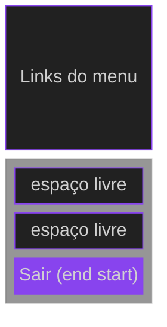

### 5.16 Grade de ícones responsiva

Todos os ícones centralizados, com um item que preenche a célula inteira.

```css
.icones {
  display: grid;
  grid-template-columns: repeat(auto-fit, minmax(120px, 1fr));
  grid-auto-rows: 120px;
  gap: 12px;
  place-items: center;
}

.icones .destaque {
  place-self: stretch;
}
```

O `place-items: center` é a regra geral. O `place-self: stretch` do item `destaque` o devolve ao comportamento de preencher a célula.

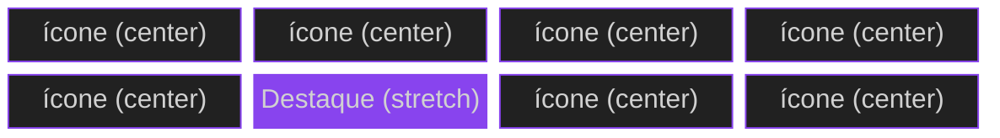

---

## 6. Principais erros e confusões

### 6.1 Inverter a ordem dos valores

```css
.item {
  place-self: end start;
}
```

A leitura correta é `align-self: end` (embaixo) e `justify-self: start` (à esquerda). Se você queria o canto superior direito, o certo é `start end`.

```text
primeiro valor → eixo block  (vertical)
segundo valor  → eixo inline (horizontal)
```

### 6.2 Aplicar `place-self` no container

```css
.container {
  display: grid;
  place-self: center; /* não é isso que você quer */
}
```

`place-self` age em **quem é item**. Para definir uma regra geral para todos os itens, use `place-items` no container.

```text
container → place-items
item      → place-self
```

### 6.3 Achar que o item muda de célula

O `place-self` não move o item para outra linha ou coluna. Quem escolhe a célula é `grid-row`, `grid-column`, `grid-area` ou o posicionamento automático. O `place-self` só decide como o item fica **dentro da célula que ele já tem**.

### 6.4 Esperar efeito quando não sobra espaço

Se a área tem exatamente o tamanho do item, não há espaço para alinhar e nada parece mudar. Isso acontece, por exemplo, quando a linha tem altura `auto` e o item é o maior da linha.

```text
área = tamanho do item → nada para alinhar
área maior que o item  → place-self faz diferença
```

### 6.5 Usar `stretch` com `width` ou `height` definidos

```css
.item {
  width: 100px;
  place-self: stretch;
}
```

O `stretch` só estica tamanhos `auto`. Com `width: 100px`, o item continua com 100px na horizontal. Remova o tamanho fixo se você quer que ele preencha a área.

### 6.6 Achar que um valor só mexe em um eixo

```css
.item {
  place-self: center;
}
```

Esse código afeta os **dois eixos**, pois o valor é copiado. Para alterar só um, escreva `place-self: center auto`, ou use `align-self` ou `justify-self` separadamente.

### 6.7 Usar `left` ou `right` no primeiro valor

Esses valores só existem para o eixo inline. Na primeira posição, eles seriam aplicados ao `align-self`, que não os aceita, e a declaração inteira é **ignorada**. Use `start left` ou `start right`.

### 6.8 Esperar que `justify-self` funcione no Flexbox

No Flexbox, o `justify-self` é ignorado. Se você usa `place-self` em um item flex, somente a parte do `align-self` terá efeito. Para posicionar itens flex no eixo principal, use `justify-content` ou margens `auto`.

### 6.9 Esquecer das margens `auto`

Quando um item tem `margin: auto` em um eixo, a margem absorve o espaço livre **antes** do alinhamento, e o `place-self` não tem efeito naquele eixo. Se o `place-self` parece ser ignorado, confira se há uma margem `auto` no item.

### 6.10 Confundir `place-self` com `text-align`

```css
.item {
  place-self: center; /* move a CAIXA do item */
  text-align: center; /* alinha o TEXTO dentro da caixa */
}
```

São coisas diferentes, e você pode usar as duas ao mesmo tempo.

### 6.11 Confundir `place-self` com `place-items` e `place-content`

| Propriedade | Onde se aplica | O que alinha |
| --- | --- | --- |
| `place-content` | container | o conjunto de linhas e colunas dentro do container |
| `place-items` | container | todos os itens dentro das suas áreas |
| `place-self` | item | um único item dentro da sua área |

### 6.12 Esperar que a imagem estique

Uma imagem tem proporção própria. No Grid, o comportamento `normal` evita distorcê-la e a trata como `start`. Para ocupar a área, defina `width: 100%` (e, se necessário, `object-fit`).

### 6.13 Esquecer que o item precisa ser filho direto

Só os **filhos diretos** do container são Grid Items. Um elemento dentro de um filho não participa do Grid, e o `place-self` nele não tem efeito de Grid.

```text
.container (display: grid)
└── .filho      ← Grid Item: place-self funciona
    └── .neto   ← não é Grid Item
```

### 6.14 Achar que `flex-start` é diferente de `start` no Grid

Não é. Dentro do Grid, `flex-start` e `flex-end` se comportam como `start` e `end`. Escolha `start` e `end` para deixar claro qual layout está em uso.

### 6.15 Esperar que `baseline` funcione no eixo inline

O alinhamento por baseline mostra seu efeito no **eixo block**, entre itens da mesma linha. Na segunda posição do `place-self`, em textos horizontais comuns, ele costuma se comportar como `start`. Use `baseline` na **primeira** posição (por exemplo, `baseline start`).

### 6.16 Esperar diferença de `safe` e `unsafe` sem overflow

`safe` e `unsafe` só importam quando o item é **maior que a área**. Se ele cabe, `safe center`, `unsafe center` e `center` são idênticos.

### 6.17 Escrever valor global junto com outro valor

```css
.item {
  place-self: initial center; /* inválido */
}
```

Os valores globais (`inherit`, `initial`, `unset`, `revert`, `revert-layer`) valem para a propriedade inteira e **não podem ser combinados** com outro valor.

---

## 7. Tabela de fixação

### 7.1 Conceitos

| Conceito | O que significa |
| --- | --- |
| `place-self` | shorthand de `align-self` + `justify-self` |
| Onde se aplica | no **item** do Grid |
| O que alinha | a caixa do item dentro da sua Grid Area |
| Ordem dos valores | 1º `align-self` (block), 2º `justify-self` (inline) |
| Um valor só | é copiado para os dois eixos |
| Valor inicial | `auto` (segue o `place-items` do container) |
| Eixo block | direção em que os blocos se empilham (vertical, em português) |
| Eixo inline | direção em que o texto corre (horizontal, em português) |
| Grid Area | o espaço que o item ocupa, de uma ou mais células |

### 7.2 Valores e o que cada um muda

| Valor | O que faz | Muda a posição? | Muda o tamanho? |
| --- | --- | --- | --- |
| `auto` | segue o `place-items` do container | depende | depende |
| `normal` | no Grid, age como `stretch` (ou `start` com proporção própria) | não | sim |
| `stretch` | preenche a área, se o tamanho for `auto` | não | sim |
| `start` | início do eixo | sim | sim (tamanho do conteúdo) |
| `end` | final do eixo | sim | sim (tamanho do conteúdo) |
| `center` | centro do eixo | sim | sim (tamanho do conteúdo) |
| `self-start` / `self-end` | início/final segundo o modo de escrita do item | igual a `start` / `end` | igual |
| `flex-start` / `flex-end` | no Grid, iguais a `start` / `end` | igual | igual |
| `left` / `right` | esquerda/direita físicas, só na 2ª posição | sim | sim |
| `baseline` / `first baseline` | alinha pela linha de base do texto | sim | não estica |
| `last baseline` | alinha pela última linha de texto | sim | não estica |
| `safe` + posição | evita cortar o início do conteúdo | só com overflow | não |
| `unsafe` + posição | mantém a posição, mesmo com overflow | só com overflow | não |
| `anchor-center` | centraliza na âncora (sem âncora, age como `center`) | igual a `center` | igual |
| globais | definem de onde o valor vem | sem efeito próprio | sem efeito próprio |

### 7.3 Família de propriedades

| Propriedade | Aplicada em | Eixos |
| --- | --- | --- |
| `place-content` | container | block e inline (conjunto do Grid) |
| `place-items` | container | block e inline (todos os itens) |
| `place-self` | item | block e inline (um item) |
| `align-self` | item | block |
| `justify-self` | item | inline |

---

## 8. Resumo

- O `place-self` **posiciona um item dentro da Grid Area dele**. Ele não muda a célula, a linha ou a coluna.
- É um **shorthand**: `place-self: A J` equivale a `align-self: A` e `justify-self: J`.
- A **ordem** é: primeiro o eixo block (`align`), depois o eixo inline (`justify`).
- Com **um valor só**, ele é copiado para os dois eixos.
- O valor inicial é `auto`, que segue o `place-items` do container.
- `stretch` só estica tamanhos `auto` e respeita limites como `max-width`.
- `start`, `end` e `center` fazem o item ter o tamanho que o conteúdo pede.
- `flex-start`, `flex-end`, `self-start` e `self-end` são, na prática, apelidos de `start` e `end` na maioria dos casos.
- `baseline` mostra seu efeito no eixo block, entre itens da mesma linha.
- `safe` e `unsafe` só mudam algo quando o item é maior que a área.
- O uso mais comum é **regra geral + exceção**: `place-items` no container e `place-self` no item que foge da regra.

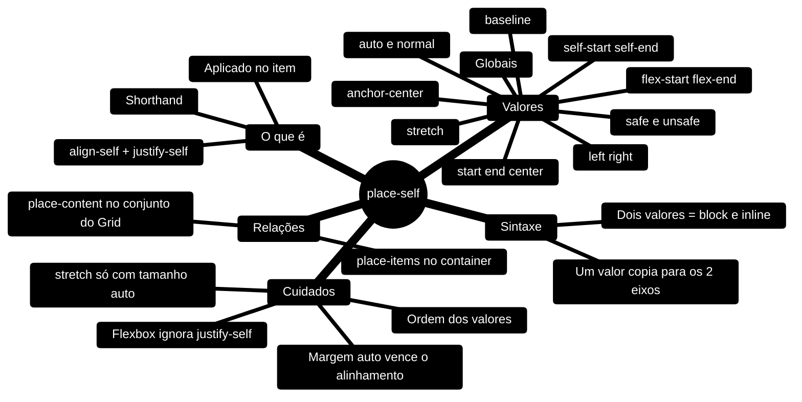

---

## 9. Referências

- [MDN — `place-self`](https://developer.mozilla.org/pt-BR/docs/Web/CSS/place-self)
- [MDN — `align-self`](https://developer.mozilla.org/pt-BR/docs/Web/CSS/align-self)
- [MDN — `justify-self`](https://developer.mozilla.org/pt-BR/docs/Web/CSS/justify-self)
- [MDN — `place-items`](https://developer.mozilla.org/pt-BR/docs/Web/CSS/place-items)
- [MDN — `place-content`](https://developer.mozilla.org/pt-BR/docs/Web/CSS/place-content)
- [MDN — Alinhamento de caixas em grid layout](https://developer.mozilla.org/pt-BR/docs/Web/CSS/CSS_grid_layout/Box_alignment_in_grid_layout)
- [W3C — CSS Box Alignment Module Level 3](https://www.w3.org/TR/css-align-3/)

---

[Gabriel Felipe de Oliveira Rateiro](https://github.com/gabrielfelipeoliveira55)