# CSS Grid Layout — `place-content`

> **Em uma frase:** `place-content` decide **onde a grade inteira (todas as colunas e linhas juntas) fica dentro do contêiner** e **como o espaço que sobrou é distribuído entre as trilhas**.

## Índice

1. [O que é o `place-content` e para que ele serve?](#1-o-que-é-o-place-content-e-para-que-ele-serve)
2. [Sintaxe](#2-sintaxe)
3. [Lista de possíveis valores](#3-lista-de-possíveis-valores)
   - [3.1 Sintaxe formal e lista completa](#31-sintaxe-formal-e-lista-completa)
   - [3.2 Valores agrupados por tipo](#32-valores-agrupados-por-tipo)
   - [3.3 O que cada valor altera visualmente](#33-o-que-cada-valor-altera-visualmente)
   - [3.4 Comparando a distribuição do espaço](#34-comparando-a-distribuição-do-espaço)
   - [3.5 Laboratório para testar os valores](#35-laboratório-para-testar-os-valores)
4. [Os valores, um por um](#4-os-valores-um-por-um)
   - [4.1 `normal`](#41-normal)
   - [4.2 `start`](#42-start)
   - [4.3 `end`](#43-end)
   - [4.4 `center`](#44-center)
   - [4.5 `flex-start` e `flex-end`](#45-flex-start-e-flex-end)
   - [4.6 `left` e `right`](#46-left-e-right)
   - [4.7 `stretch`](#47-stretch)
   - [4.8 `space-between`](#48-space-between)
   - [4.9 `space-around`](#49-space-around)
   - [4.10 `space-evenly`](#410-space-evenly)
   - [4.11 Quando não dá para distribuir: os alinhamentos de reserva](#411-quando-não-dá-para-distribuir-os-alinhamentos-de-reserva)
   - [4.12 `baseline`, `first baseline` e `last baseline`](#412-baseline-first-baseline-e-last-baseline)
   - [4.13 `safe` e `unsafe`](#413-safe-e-unsafe)
   - [4.14 Valores globais](#414-valores-globais)
   - [4.15 Combinando valores diferentes em cada eixo](#415-combinando-valores-diferentes-em-cada-eixo)
5. [Exemplos de layouts e inspirações](#5-exemplos-de-layouts-e-inspirações)
   - [5.1 Grade centralizada na tela](#51-grade-centralizada-na-tela)
   - [5.2 Quatro cantos com `space-between`](#52-quatro-cantos-com-space-between)
   - [5.3 Botões no canto inferior direito](#53-botões-no-canto-inferior-direito)
   - [5.4 Barra de ícones com `center space-evenly`](#54-barra-de-ícones-com-center-space-evenly)
   - [5.5 Seletor de alinhamento com classes](#55-seletor-de-alinhamento-com-classes)
   - [5.6 Tabuleiro de jogo centralizado](#56-tabuleiro-de-jogo-centralizado)
   - [5.7 Cartões com espaço uniforme](#57-cartões-com-espaço-uniforme)
   - [5.8 Colunas `auto` que se esticam](#58-colunas-auto-que-se-esticam)
   - [5.9 `place-content` e `place-items` juntos](#59-place-content-e-place-items-juntos)
   - [5.10 Página de erro 404](#510-página-de-erro-404)
   - [5.11 Galeria responsiva que continua centralizada](#511-galeria-responsiva-que-continua-centralizada)
   - [5.12 Mensagens coladas na base](#512-mensagens-coladas-na-base)
   - [5.13 Grade larga com `safe center`](#513-grade-larga-com-safe-center)
6. [Principais erros e confusões](#6-principais-erros-e-confusões)
   - [6.1 Como diagnosticar](#61-como-diagnosticar)
   - [6.2 Grupo A: não existe espaço livre](#62-grupo-a-não-existe-espaço-livre)
   - [6.3 Grupo B: o valor escolhido não muda nada](#63-grupo-b-o-valor-escolhido-não-muda-nada)
   - [6.4 Grupo C: a declaração não está sendo aplicada](#64-grupo-c-a-declaração-não-está-sendo-aplicada)
   - [6.5 Tabela de sintomas](#65-tabela-de-sintomas)
   - [6.6 Checklist rápido antes de pedir ajuda](#66-checklist-rápido-antes-de-pedir-ajuda)
7. [Tabela de fixação](#7-tabela-de-fixação)
8. [Resumo](#8-resumo)
9. [Referências](#9-referências)

---

## 1. O que é o `place-content` e para que ele serve?

O `place-content` é uma propriedade CSS aplicada **no contêiner do Grid** (o elemento que tem `display: grid`). Ela serve para responder a uma pergunta simples: **"o que fazer com o espaço que sobrou dentro do contêiner?"**

```css
.container {
  display: grid;
  place-content: center;
}
```

Esse código centraliza a **grade inteira** dentro do contêiner. Para entender o que isso quer dizer, vamos por partes.

### 1.1 Primeiro: o que é a grade e o que são trilhas?

Quando você escreve `display: grid`, o navegador divide o contêiner em **linhas** e **colunas**. Cada linha ou coluna é chamada de **trilha** (em inglês, *track*):

- uma **trilha de coluna** é uma coluna do Grid (definida por `grid-template-columns`);
- uma **trilha de linha** é uma linha do Grid (definida por `grid-template-rows`).

O conjunto de todas as trilhas, somado aos espaçamentos entre elas (`gap`), forma **a grade**.

```css
.container {
  display: grid;
  grid-template-columns: repeat(3, 100px);
  grid-template-rows: repeat(2, 100px);
  gap: 10px;
}
```

```text
┌───────┐ ┌───────┐ ┌───────┐
│ 100px │ │ 100px │ │ 100px │   ← 3 trilhas de coluna
└───────┘ └───────┘ └───────┘
┌───────┐ ┌───────┐ ┌───────┐
│       │ │       │ │       │   ← 2 trilhas de linha
└───────┘ └───────┘ └───────┘

Largura da grade: 3 × 100 + 2 × 10 = 320px
Altura da grade:  2 × 100 + 1 × 10 = 210px
```

> Se algum item ficar fora das trilhas que você declarou, o Grid cria **trilhas implícitas** (controladas por `grid-auto-rows` e `grid-auto-columns`). Elas também fazem parte da grade e entram na conta.

Nem sempre a grade ocupa todo o contêiner. Se o contêiner tem `600px` de largura e a grade tem `320px`, sobram `280px`. É com esse espaço que o `place-content` trabalha.

### 1.2 A ideia central: espaço livre

Tudo o que o `place-content` faz depende do **espaço livre** (em inglês, *free space*). Guarde esta conta, porque ela explica quase todos os casos em que "nada acontece":

```text
espaço livre = tamanho da área de conteúdo do contêiner − (soma das trilhas + soma dos gaps)
```

Ela vale para cada eixo, separadamente:

| Eixo | Tamanho do contêiner | Soma da grade |
| --- | --- | --- |
| Horizontal | largura da **área de conteúdo** | colunas + `column-gap` |
| Vertical | altura da **área de conteúdo** | linhas + `row-gap` |

Dois detalhes importantes:

- **Área de conteúdo** é o contêiner **sem** `padding` e **sem** `border`. Qualquer `padding` que você adiciona reduz o espaço livre.
- Se o espaço livre for **zero**, o `place-content` não tem o que mover. Se for **negativo**, a grade é maior que o contêiner (*overflow*), e o comportamento muda (seção 4.13).

```text
┌─────────────────────── contêiner: 600px ───────────────────────┐
│ ┌───────┐ ┌───────┐ ┌───────┐                                  │
│ │ 100px │ │ 100px │ │ 100px │      ← espaço livre: 300px →     │
│ └───────┘ └───────┘ └───────┘                                  │
└────────────────────────────────────────────────────────────────┘
        grade: 300px                        sobra: 300px
```

### 1.3 O que é um shorthand?

`place-content` é um **shorthand**, ou seja, uma forma abreviada de escrever duas propriedades de uma vez só:

| Propriedade | O que controla |
| --- | --- |
| `align-content` | a grade no **eixo block** (em escrita horizontal, o vertical) |
| `justify-content` | a grade no **eixo inline** (em escrita horizontal, o horizontal) |

```css
.container {
  place-content: end center;
}
```

é o mesmo que:

```css
.container {
  align-content: end;
  justify-content: center;
}
```

### 1.4 O que são o eixo block e o eixo inline?

O CSS não pensa apenas em "horizontal" e "vertical", porque existem idiomas escritos em outras direções (como o japonês, que pode ser escrito na vertical). Por isso, ele usa dois nomes:

- **Eixo inline:** a direção em que o texto corre. Em português, da esquerda para a direita.
- **Eixo block:** a direção em que os blocos se empilham. Em português, de cima para baixo.

```text
              EIXO BLOCK
                  ↑
                  │
   EIXO INLINE ←──┼──→
                  │
                  ↓
```

Em um site em português, você pode ler **block = vertical** e **inline = horizontal**. Essa leitura vale para a escrita horizontal tradicional. Em modos de escrita verticais (`writing-mode: vertical-rl`, por exemplo), os dois eixos giram.

### 1.5 Conteúdo versus itens

Esta é a diferença que mais gera confusão, então vale fixar. Existem três "famílias" de propriedades `place-*`, e cada uma move uma coisa diferente:

| Propriedade | Onde se aplica | O que ela move |
| --- | --- | --- |
| `place-content` | contêiner | a **grade inteira** (o conjunto de trilhas) dentro do contêiner |
| `place-items` | contêiner | **todos os itens**, cada um dentro da sua própria célula |
| `place-self` | item | **um único item**, dentro da sua própria célula |


Em outras palavras, o `place-content` age **de fora para dentro** (contêiner → trilhas), enquanto o `place-items` age **dentro de cada célula**.

### 1.6 Por trás dos panos: como o navegador usa o espaço livre

O `place-content` não age sozinho. Antes dele, o navegador precisa decidir **quanto cada trilha mede**. Só depois disso é que se descobre quanto espaço sobrou. Essa ordem explica muitos casos de "não funcionou":

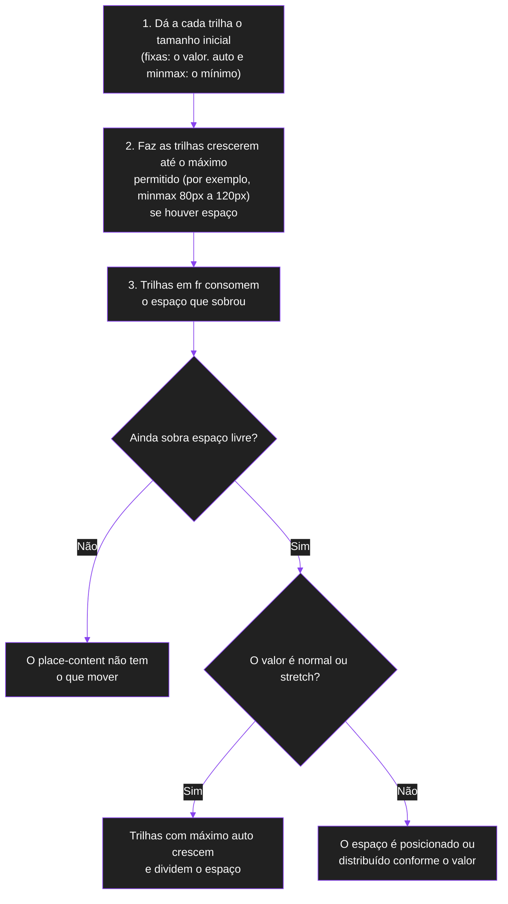

Pontos importantes desse processo:

- **As trilhas `fr` e as trilhas que crescem até um máximo são resolvidas antes.** Se elas consumirem todo o espaço, o `place-content` chega tarde demais: não sobra nada.
- O valor inicial é `normal`, que no Grid se comporta como `stretch`. Por isso, **sem escrever nada**, as trilhas `auto` já crescem para preencher o contêiner.
- Ao escolher um valor de posição (`start`, `end`, `center`) ou de distribuição (`space-*`), o `stretch` deixa de valer. As trilhas `auto` **voltam ao tamanho do conteúdo**. Esse é um efeito colateral que surpreende muita gente (erro 6).

### 1.7 Suporte dos navegadores

Segundo a MDN, a propriedade é considerada **Baseline: amplamente disponível**, funcionando nos principais navegadores desde janeiro de 2020. Valores mais específicos, como `baseline`, podem ter suporte irregular, e vale conferir a tabela de compatibilidade da MDN antes de depender deles.

> 💡 **Visão de carreira:** `place-content: center` é uma das formas mais curtas de centralizar uma grade inteira. Saber **por que** ela funciona (existe espaço livre para distribuir) é o que permite depurar rapidamente o "coloquei e nada mudou", uma situação comum em code review e em projetos reais.

---

## 2. Sintaxe

```css
.container {
  place-content: <align-content> <justify-content>;
}
```

Segundo a MDN, a forma completa é:

```text
place-content: <'align-content'> <'justify-content'>?
```

O `?` indica que o segundo valor é opcional.

### 2.1 A ordem dos valores

O **primeiro valor** controla o `align-content` (eixo block) e o **segundo** controla o `justify-content` (eixo inline).

```text
place-content:   end      center
                  │         │
                  ▼         ▼
            align-content  justify-content
            (eixo block)   (eixo inline)
```

> **Dica para não esquecer:** na ordem alfabética, `align` vem antes de `justify`. O `place-content` segue essa mesma ordem. Muita gente escreve `<horizontal> <vertical>` por instinto e se confunde.

### 2.2 O que acontece com um valor só?

Se você escrever apenas um valor, o navegador o **copia para os dois eixos**, desde que ele seja válido para ambos:

```css
.container {
  place-content: center;
}
```

equivale a:

```css
.container {
  align-content: center;
  justify-content: center;
}
```

### 2.3 O que acontece com dois valores?

Cada eixo recebe o seu valor:

```css
.container {
  place-content: start center;
}
```

```text
align-content:   start   → a grade vai para o topo
justify-content: center  → a grade fica no meio na horizontal
```

```text
┌──────────────────────────────────┐
│        ┌────┬────┬────┐          │
│        │    │    │    │          │
│        └────┴────┴────┘          │
│                                  │
│                                  │
└──────────────────────────────────┘
```

### 2.4 Quando um valor único é inválido

Alguns valores só existem em **um** dos eixos. Se você escrever um deles sozinho, ele seria copiado para um eixo que não o aceita, e **a declaração inteira é descartada** pelo navegador.

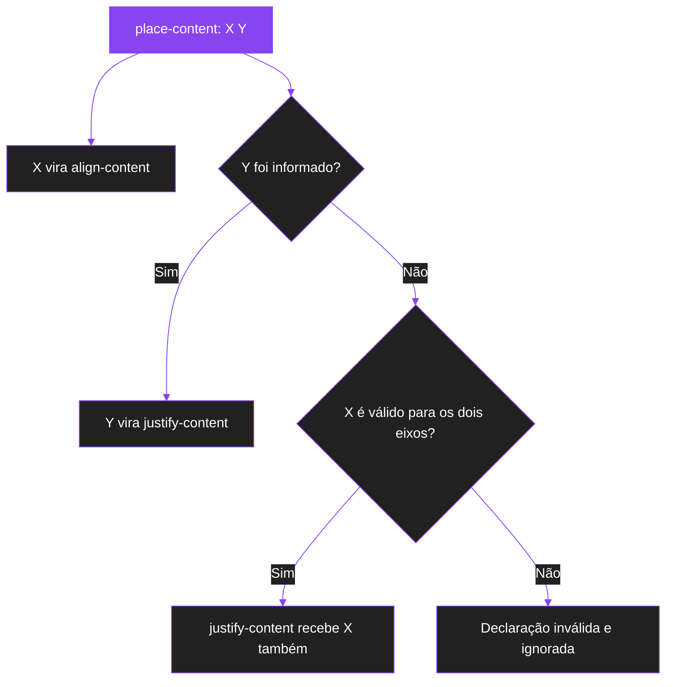

| Declaração | Válida? | Motivo |
| --- | --- | --- |
| `place-content: center;` | Sim | `center` serve aos dois eixos |
| `place-content: left;` | Não | `align-content` não aceita `left` |
| `place-content: start left;` | Sim | vertical `start`, horizontal `left` |
| `place-content: left start;` | Não | o 1º valor (vertical) não pode ser `left` |
| `place-content: baseline;` | Não (segundo a MDN) | `justify-content` não aceita `baseline` |
| `place-content: baseline center;` | Sim | `baseline` fica no 1º valor |
| `place-content: center centre;` | Não | erro de digitação |

### 2.5 O atalho reescreve os dois valores

Por ser um atalho, `place-content` sempre define **os dois** valores de uma vez. Se ele aparecer **depois** de um `justify-content` isolado, sobrescreve esse valor:

```css
.container {
  justify-content: space-between;
  place-content: center;
}
```

Aqui o `justify-content` termina como `center`, e o `space-between` é perdido. Na ordem inversa, o `justify-content` vence só no eixo horizontal:

```css
.container {
  place-content: center;
  justify-content: space-between;
}
```

Resultado: `align-content: center` e `justify-content: space-between`.

### 2.6 Informações da propriedade

| Característica | Valor |
| --- | --- |
| Valor inicial | `normal` (para as duas propriedades que compõem o atalho) |
| Onde se aplica | contêineres de bloco, flexíveis e de grade (esta documentação trata do Grid) |
| Herdado? | não |
| Valor calculado | conforme especificado |
| Tipo de animação | discreto (a propriedade "pula" de um valor para outro, sem transição suave) |

### 2.7 Revisão rápida: `align-content` e `justify-content`

Como o `place-content` é feito dessas duas propriedades, vale relembrar o que cada uma faz.

| Propriedade | Eixo | Direção | Posição no `place-content` |
| --- | --- | --- | --- |
| `align-content` | block | vertical | 1º valor |
| `justify-content` | inline | horizontal | 2º valor (opcional) |

E a diferença entre os três grupos de propriedades de alinhamento:

| Grupo | Propriedades | Alvo | Onde se aplica |
| --- | --- | --- | --- |
| Conteúdo | `align-content`, `justify-content`, `place-content` | as **trilhas** (a grade) | contêiner |
| Itens | `align-items`, `justify-items`, `place-items` | todos os **itens** em suas células | contêiner |
| Individual | `align-self`, `justify-self`, `place-self` | **um item** em sua célula | item |

---

## 3. Lista de possíveis valores

Esta seção responde a três perguntas: **quais valores o `place-content` aceita**, **como eles se agrupam** e **o que cada um muda (ou não muda) visualmente**.

### 3.1 Sintaxe formal e lista completa

Cada um dos dois valores segue a sintaxe da propriedade correspondente:

```text
align-content   = normal | <baseline-position> | <content-distribution>
                | <overflow-position>? <content-position>

justify-content = normal | <content-distribution>
                | <overflow-position>? [ <content-position> | left | right ]
```

Os nomes entre `<` e `>` são grupos de valores:

```text
<content-position>      = center | start | end | flex-start | flex-end
<content-distribution>  = space-between | space-around | space-evenly | stretch
<baseline-position>     = [ first | last ]? baseline
<overflow-position>     = unsafe | safe
```

**Estes são todos os valores que o `place-content` aceita:**

| # | Valor | Aceito em qual posição? |
| --- | --- | --- |
| 1 | `normal` | 1ª e 2ª |
| 2 | `start` | 1ª e 2ª |
| 3 | `end` | 1ª e 2ª |
| 4 | `center` | 1ª e 2ª |
| 5 | `flex-start` | 1ª e 2ª |
| 6 | `flex-end` | 1ª e 2ª |
| 7 | `left` | **somente a 2ª** |
| 8 | `right` | **somente a 2ª** |
| 9 | `stretch` | 1ª e 2ª |
| 10 | `space-between` | 1ª e 2ª |
| 11 | `space-around` | 1ª e 2ª |
| 12 | `space-evenly` | 1ª e 2ª |
| 13 | `baseline` | **somente a 1ª** |
| 14 | `first baseline` | **somente a 1ª** |
| 15 | `last baseline` | **somente a 1ª** |
| 16 | `safe` + posição (`safe center`, `safe end`, ...) | 1ª e 2ª |
| 17 | `unsafe` + posição (`unsafe center`, `unsafe end`, ...) | 1ª e 2ª |
| 18 | valores globais: `inherit`, `initial`, `unset`, `revert`, `revert-layer` | declaração inteira |

> **Atenção:** os valores globais (linha 18) valem para a propriedade toda. Escreva `place-content: initial;`, e nunca `place-content: initial center;`.

### 3.2 Valores agrupados por tipo

Para decorar, é mais fácil pensar em grupos:

| Grupo | Valores | Ideia |
| --- | --- | --- |
| **Automático** | `normal` | "o navegador decide" (no Grid, age como `stretch`) |
| **Posições** | `start`, `end`, `center` | "empurre a grade para o início, o final ou o meio" |
| **Nomes do Flexbox** | `flex-start`, `flex-end` | "no Grid, são apelidos de `start` e `end`" |
| **Posições físicas** | `left`, `right` | "esquerda/direita da tela" (só na 2ª posição) |
| **Distribuição** | `space-between`, `space-around`, `space-evenly` | "reparta o espaço entre as trilhas" |
| **Preenchimento** | `stretch` | "faça as trilhas `auto` crescerem" |
| **Linha de base** | `baseline`, `first baseline`, `last baseline` | "alinhe pela linha do texto" (só na 1ª posição) |
| **Segurança contra overflow** | `safe`, `unsafe` | "o que fazer se a grade for maior que o contêiner" |
| **Globais** | `inherit`, `initial`, `unset`, `revert`, `revert-layer` | "escolha de onde o valor vem" |

### 3.3 O que cada valor altera visualmente

Nem todo valor produz uma mudança visível. Alguns são **apelidos** de outros, e outros só **funcionam em situações específicas**.

| Valor | Move a grade? | Muda o tamanho das trilhas? | Quando o efeito aparece |
| --- | --- | --- | --- |
| `normal` | não | **sim**: trilhas `auto` crescem | só com trilhas `auto` e espaço livre |
| `start` | **sim**: para o início | trilhas `auto` voltam ao tamanho do conteúdo | só se sobra espaço |
| `end` | **sim**: para o final | trilhas `auto` voltam ao tamanho do conteúdo | só se sobra espaço |
| `center` | **sim**: para o meio | trilhas `auto` voltam ao tamanho do conteúdo | só se sobra espaço |
| `flex-start` / `flex-end` | igual a `start` / `end` | igual | **nunca** difere de `start` / `end` no Grid |
| `left` / `right` | **sim** (eixo inline) | igual a `start` / `end` | só na 2ª posição. Difere de `start` / `end` em idiomas da direita para a esquerda |
| `stretch` | não | **sim**: trilhas `auto` crescem | só trilhas `auto`. Trilhas fixas e `fr` não mudam |
| `space-between` | **sim**: espaço só entre as trilhas | trilhas `auto` voltam ao tamanho do conteúdo | 2 ou mais trilhas no eixo e espaço livre positivo |
| `space-around` | **sim**: espaço ao redor de cada trilha | idem | espaço livre positivo (com 1 trilha, age como `center`) |
| `space-evenly` | **sim**: espaços idênticos | idem | espaço livre positivo (com 1 trilha, age como `center`) |
| `baseline` / `first baseline` / `last baseline` | raramente visível | não | só na 1ª posição. Em uma grade comum costuma ter o mesmo resultado de `start` (first) ou `end` (last) |
| `safe` + posição | só se a grade for maior que o contêiner | não | **sem overflow, não muda nada** |
| `unsafe` + posição | só se a grade for maior que o contêiner | não | **sem overflow, não muda nada** |
| globais | sem efeito próprio | sem efeito próprio | alteram qual valor vale |

Um jeito rápido de lembrar quando o `place-content` **não** muda nada que você veja:

```text
1. Não sobra espaço livre no eixo     → nada tem para onde ir
2. As trilhas são fr, % ou crescem    → consomem o espaço antes
3. O valor é apelido de outro         → flex-start e flex-end
4. O valor é stretch com trilhas fixas → só trilhas auto crescem
5. O elemento não é um contêiner grid → o Grid não alinha o que não é grid
```

### 3.4 Comparando a distribuição do espaço

Imagine um contêiner de `600px` de largura (sem `padding`) com **três colunas de `100px`** e sem `gap`. A grade ocupa `300px`, e **sobram `300px`**.

| Valor (eixo horizontal) | Como os `300px` são distribuídos |
| --- | --- |
| `start` | todo o espaço fica depois da última coluna |
| `end` | todo o espaço fica antes da primeira coluna |
| `center` | `150px` antes e `150px` depois |
| `space-between` | `150px` entre cada par de colunas, `0` nas pontas |
| `space-around` | `50px` em cada ponta e `100px` entre colunas |
| `space-evenly` | `75px` nas pontas e `75px` entre colunas |

Veja o mesmo caso em diagrama. Cada linha mostra um valor, na ordem: `start`, `end`, `center`, `space-between`, `space-around`, `space-evenly`. As caixas roxas são as colunas, e os espaços vazios são o espaço livre.

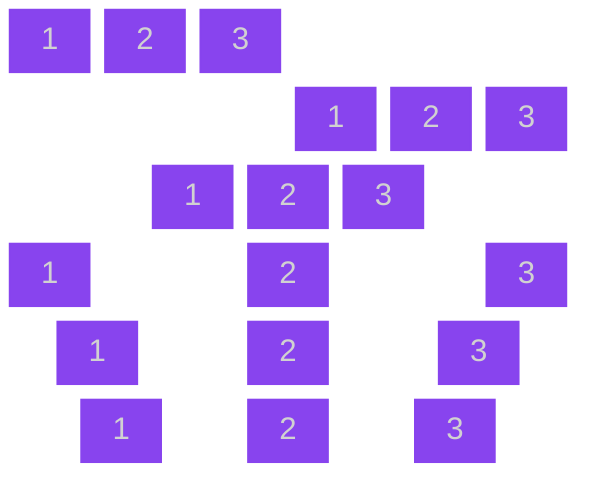

#### A conta passo a passo (com `padding` e `gap`)

Agora um caso mais realista:

```css
.container {
  display: grid;
  grid-template-columns: repeat(3, 100px);
  column-gap: 10px;
  width: 600px;
  padding: 0 20px;
  box-sizing: border-box;
}
```

| Etapa | Cálculo | Resultado |
| --- | --- | --- |
| Largura da área de conteúdo | `600 − 20 − 20` | `560px` |
| Tamanho da grade | `3 × 100 + 2 × 10` | `320px` |
| Espaço livre | `560 − 320` | `240px` |

Com esse espaço livre de `240px`:

| Valor | Espaço antes | Espaço entre colunas (além do `gap`) | Espaço depois |
| --- | --- | --- | --- |
| `center` | `120px` | `0` | `120px` |
| `space-between` | `0` | `120px` | `0` |
| `space-around` | `40px` | `80px` | `40px` |
| `space-evenly` | `60px` | `60px` | `60px` |

> ⚠️ Os espaçamentos do `gap` **continuam existindo**. O espaço distribuído pelo `place-content` é **somado** a eles, e o `gap` funciona como a distância mínima entre as trilhas.

### 3.5 Laboratório para testar os valores

Cole este código em uma página e veja cada valor em ação. A borda tracejada é o **contêiner**, e os blocos roxos são as **colunas da grade**.

```html
<div class="lab">
  <div class="caixa pc-start"><span>1</span><span>2</span><span>3</span></div>
  <div class="caixa pc-end"><span>1</span><span>2</span><span>3</span></div>
  <div class="caixa pc-center"><span>1</span><span>2</span><span>3</span></div>
  <div class="caixa pc-between"><span>1</span><span>2</span><span>3</span></div>
  <div class="caixa pc-around"><span>1</span><span>2</span><span>3</span></div>
  <div class="caixa pc-evenly"><span>1</span><span>2</span><span>3</span></div>
</div>
```

```css
.lab {
  display: grid;
  gap: 12px;
}

.caixa {
  display: grid;
  grid-template-columns: repeat(3, 60px);
  grid-template-rows: 60px;
  width: 360px;
  height: 100px;
  border: 2px dashed #8844ee;
}

.caixa span {
  display: grid;
  place-items: center;
  background: #8844ee;
  color: #ffffff;
}
```

```css
.pc-start   { place-content: center start; }
.pc-end     { place-content: center end; }
.pc-center  { place-content: center; }
.pc-between { place-content: center space-between; }
.pc-around  { place-content: center space-around; }
.pc-evenly  { place-content: center space-evenly; }
```

Como o laboratório funciona:

- Cada `.caixa` é um contêiner grid com **três colunas de `60px`** (`180px` no total) dentro de `360px`. Sobram `180px` na horizontal.
- O `center` no primeiro valor centraliza a grade na vertical (a linha tem `60px` em `100px` de altura).
- O segundo valor é o que muda de uma caixa para outra e mostra a distribuição horizontal.
- O `place-items: center` dentro dos `span` só centraliza o número **dentro** de cada célula. Ele não tem relação com o `place-content`.

---

## 4. Os valores, um por um

Nos desenhos abaixo, a caixa grande é o **contêiner** e os blocos são as **colunas da grade**. Cada valor é explicado em quatro partes:

- **O que é:** a definição simples do valor.
- **O que muda visualmente:** o que você vê na tela.
- **O que não muda:** o que continua igual.
- **Quando você percebe:** em que situação o efeito aparece.

Os exemplos mostram o eixo horizontal (2º valor). O raciocínio é o mesmo no vertical (1º valor).

### 4.1 `normal`

```css
.container {
  place-content: normal;
}
```

**O que é:** o valor inicial. Significa "comportamento padrão do tipo de layout". No Grid, `normal` se comporta como `stretch`.

**O que muda visualmente:** as trilhas de tamanho `auto` **crescem** e dividem o espaço livre. Trilhas fixas e `fr` não são alteradas.

```text
grid-template-columns: auto auto auto

┌──────────────────────────────────────┐
│ ┌───────────┬───────────┬──────────┐ │
│ │     1     │     2     │     3    │ │
│ └───────────┴───────────┴──────────┘ │
└──────────────────────────────────────┘
   as colunas auto preenchem o contêiner
```

**O que não muda:** a ordem dos itens e o tamanho das trilhas fixas.

**Quando você percebe:** é o comportamento que você vê quando não escreve nada. Com trilhas todas fixas (`100px`), parece que "nada acontece", porque nada pode crescer.

### 4.2 `start`

```css
.container {
  place-content: start;
}
```

**O que é:** "empurre a grade para o início".

**O que muda visualmente:** a grade fica junto ao **início do eixo**: o topo (1º valor) ou a esquerda (2º valor), em escrita da esquerda para a direita. Todo o espaço livre fica **depois** da grade. Trilhas `auto` deixam de ser esticadas e voltam ao tamanho do conteúdo.

```text
┌──────────────────────────────────────┐
│ ┌────┬────┬────┐                     │
│ │ 1  │ 2  │ 3  │                     │
│ └────┴────┴────┘                     │
└──────────────────────────────────────┘
```

**O que não muda:** o tamanho das trilhas fixas e o `gap`.

**Quando você percebe:** quando sobra espaço no eixo. Sem espaço livre, a grade já ocupa tudo, e `start` parece igual a qualquer outro valor.

### 4.3 `end`

```css
.container {
  place-content: end;
}
```

**O que é:** "empurre a grade para o final".

**O que muda visualmente:** a grade fica junto ao **final do eixo**: a base (1º valor) ou a direita (2º valor). O espaço livre fica **antes** da grade.

```text
┌──────────────────────────────────────┐
│                     ┌────┬────┬────┐ │
│                     │ 1  │ 2  │ 3  │ │
│                     └────┴────┴────┘ │
└──────────────────────────────────────┘
```

**O que não muda:** a ordem das trilhas e o `gap`.

**Quando você percebe:** quando sobra espaço no eixo.

### 4.4 `center`

```css
.container {
  place-content: center;
}
```

**O que é:** "coloque a grade no meio".

**O que muda visualmente:** o espaço livre é dividido **igualmente** entre o início e o final.

```text
┌──────────────────────────────────────┐
│         ┌────┬────┬────┐              │
│         │ 1  │ 2  │ 3  │              │
│         └────┴────┴────┘              │
└──────────────────────────────────────┘
```

**O que não muda:** o tamanho das trilhas fixas, o `gap` e a ordem dos itens.

**Quando você percebe:** quando sobra espaço no eixo. É o valor mais usado para centralizar uma grade inteira.

### 4.5 `flex-start` e `flex-end`

```css
.container {
  place-content: flex-start;
}
```

**O que é:** nomes que vêm do Flexbox. A MDN informa que, em um Grid, eles se comportam como `start` e `end`.

**O que muda visualmente:** exatamente o mesmo que `start` e `end`.

**O que não muda:** nada é diferente de `start` e `end`. Não existe situação, no Grid, em que `flex-start` se comporte de outra forma que `start`.

**Quando você percebe:** nunca há diferença. Seu editor pode sugeri-los por serem valores válidos, mas, dentro do Grid, **prefira `start` e `end`**, que deixam claro que o layout é um Grid.

### 4.6 `left` e `right`

```css
.container {
  place-content: start left;
  place-content: start right;
}
```

**O que é:** valores **físicos** para o eixo inline. `left` é sempre a esquerda da tela e `right` é sempre a direita. Já `start` e `end` são **lógicos**: dependem da direção da escrita.

```text
idioma da esquerda para a direita:   start = esquerda   end = direita
idioma da direita para a esquerda:   start = direita    end = esquerda
left  = esquerda   (sempre)
right = direita    (sempre)
```

**O que muda visualmente:** a grade vai para o lado indicado.

**O que não muda:** o eixo block. `left` e `right` só existem para o eixo inline, e por isso só podem ficar na **segunda posição**. Se o eixo da propriedade não for paralelo ao eixo inline (em alguns modos de escrita vertical), o valor se comporta como `start`.

**Quando você percebe:** quando o site pode ser exibido em um idioma da direita para a esquerda. Em português, `left` dá o mesmo resultado que `start`, e `right` dá o mesmo que `end`. Para sites que podem ser lidos em árabe ou hebraico, prefira `start` e `end`.

### 4.7 `stretch`

```css
.container {
  place-content: stretch;
}
```

**O que é:** "faça as trilhas crescerem para preencher o contêiner".

**O que muda visualmente:** o espaço livre é dividido **igualmente** entre as trilhas cujo tamanho máximo é `auto`. Elas crescem e a grade passa a ocupar o contêiner inteiro.

```text
ANTES (colunas auto, tamanho do conteúdo)       DEPOIS (stretch)
┌────────────────────────────────┐              ┌────────────────────────────────┐
│ ┌───┬───┬───┐                  │              │ ┌─────────┬─────────┬────────┐ │
│ │ 1 │ 2 │ 3 │                  │              │ │    1    │    2    │   3    │ │
│ └───┴───┴───┘                  │              │ └─────────┴─────────┴────────┘ │
└────────────────────────────────┘              └────────────────────────────────┘
```

**O que não muda:** trilhas com tamanho fixo (`100px`) e trilhas `fr` **não são alteradas**. O `gap` também continua igual.

| Tipo de trilha | `stretch` altera o tamanho? |
| --- | --- |
| `auto` | Sim |
| `minmax(100px, auto)` | Sim (o máximo é `auto`) |
| `100px`, `10rem` | Não |
| `1fr` | Não (já preenche o espaço) |
| `minmax(100px, 200px)` | Não (o máximo é fixo) |

**Quando você percebe:** só quando existem trilhas `auto` e espaço livre. Como `normal` já age como `stretch`, escrever `place-content: stretch` explicitamente costuma **não mudar nada** em relação ao padrão.

### 4.8 `space-between`

```css
.container {
  place-content: space-between;
}
```

**O que é:** "espalhe o espaço **entre** as trilhas".

**O que muda visualmente:** a primeira trilha encosta no início, a última encosta no final, e todo o espaço livre é dividido igualmente **entre** elas.

```text
┌──────────────────────────────────────┐
│ ┌────┐          ┌────┐          ┌────┐ │
│ │ 1  │          │ 2  │          │ 3  │ │
│ └────┘          └────┘          └────┘ │
└──────────────────────────────────────┘
   0 nas pontas      espaço igual entre as trilhas
```

**O que não muda:** o tamanho das trilhas e o `gap` (o espaço distribuído é **somado** a ele).

**Quando você percebe:** quando há **duas ou mais trilhas no eixo** e espaço livre positivo. Com uma trilha só, não existe "entre", e o navegador usa `start` (seção 4.11).

### 4.9 `space-around`

```css
.container {
  place-content: space-around;
}
```

**O que é:** "dê a cada trilha o **mesmo espaço dos dois lados**".

**O que muda visualmente:** o espaço livre é dividido em partes iguais, uma para cada trilha, e cada parte é repartida em duas metades (uma de cada lado). Resultado: as **pontas recebem metade** do espaço que existe entre as trilhas.

```text
┌──────────────────────────────────────┐
│   ┌────┐       ┌────┐       ┌────┐   │
│   │ 1  │       │ 2  │       │ 3  │   │
│   └────┘       └────┘       └────┘   │
└──────────────────────────────────────┘
  ½ espaço   1 espaço    1 espaço   ½ espaço
```

**O que não muda:** o tamanho das trilhas e o `gap`.

**Quando você percebe:** quando há espaço livre positivo. Com uma trilha só, ele age como `center`.

### 4.10 `space-evenly`

```css
.container {
  place-content: space-evenly;
}
```

**O que é:** "faça **todos** os espaços iguais".

**O que muda visualmente:** o espaço livre é dividido em partes idênticas, **incluindo as pontas**. O espaço antes da primeira trilha, entre as trilhas e depois da última é o mesmo.

```text
┌──────────────────────────────────────┐
│    ┌────┐     ┌────┐     ┌────┐      │
│    │ 1  │     │ 2  │     │ 3  │      │
│    └────┘     └────┘     └────┘      │
└──────────────────────────────────────┘
  espaço = espaço = espaço = espaço
```

**O que não muda:** o tamanho das trilhas e o `gap`.

**Quando você percebe:** quando há espaço livre positivo. Com uma trilha só, ele age como `center`.

#### Como não confundir os três `space-*`

```text
space-between → nenhum espaço nas pontas
space-around  → metade do espaço nas pontas
space-evenly  → o mesmo espaço nas pontas e entre as trilhas
```

### 4.11 Quando não dá para distribuir: os alinhamentos de reserva

Os valores de distribuição precisam de **espaço positivo** e, no caso de `space-between`, de **mais de uma trilha**. Quando isso não acontece, o navegador usa um alinhamento de reserva (em inglês, *fallback*), definido na especificação CSS Box Alignment:

| Valor | Reserva quando há uma única trilha ou não sobra espaço |
| --- | --- |
| `space-between` | `start` |
| `space-around` | `center` (seguro) |
| `space-evenly` | `center` (seguro) |
| `stretch` | `start` |

Por isso, `space-between` em uma grade com **uma única coluna** parece "não funcionar": o navegador a encosta no início, como `start`.

### 4.12 `baseline`, `first baseline` e `last baseline`

```css
.container {
  place-content: baseline center;
}
```

**O que é:** a **baseline** (linha de base) é a linha imaginária sobre a qual o texto "apoia" as letras. Esses valores pedem que a grade seja alinhada por essa linha.

- **`baseline`** e **`first baseline`** são o mesmo: usam a primeira linha de base. O alinhamento de reserva é `start`.
- **`last baseline`** usa a última linha de base. O alinhamento de reserva é `end`.

**O que muda visualmente:** em uma grade comum, quase nada. O resultado visual costuma ser o mesmo de `start` (first) ou `end` (last). O efeito real só aparece em situações avançadas, em que o próprio contêiner participa de um alinhamento por baseline com elementos irmãos.

**O que não muda:** o tamanho das trilhas.

**Quando você percebe:** raramente. Esses valores só valem na **1ª posição** (`align-content`), porque `justify-content` não os aceita. O suporte varia entre navegadores. Consulte a MDN antes de depender dele.

### 4.13 `safe` e `unsafe`

```css
.container {
  place-content: safe center;
  place-content: unsafe center;
}
```

**O que é:** modificadores que você coloca **antes** de uma posição (`start`, `end`, `center`). Eles controlam o que acontece quando a **grade é maior que o contêiner**.

- **`safe`:** se houver risco de perder conteúdo, o navegador alinha como `start`.
- **`unsafe`:** o navegador respeita a posição pedida, mesmo que o conteúdo ultrapasse o contêiner.

```text
grade maior que o contêiner, com center:

unsafe center                       safe center
  ┌────────────────┐                ┌────────────────┐
┌─┼── GRADE LARGA ─┼─┐              │ GRADE LARGA ───┼───┐
│ └────────────────┘ │              └────────────────┘   │
└────────────────────┘                                   └──
 vaza dos dois lados                 vaza só pelo final
```

**O que muda visualmente:** só muda algo **quando a grade é maior que o contêiner**. Nesse caso, sem `safe`, o conteúdo que vaza pelo início pode ficar **inalcançável pela rolagem**.

**O que não muda:** quando a grade cabe, `safe center`, `unsafe center` e `center` produzem exatamente o mesmo resultado.

**Quando você percebe:** em grades de largura fixa dentro de contêineres estreitos, principalmente com `overflow: auto`.

### 4.14 Valores globais

```css
.container {
  place-content: initial;
}
```

Todo valor de CSS aceita as cinco palavras globais. Elas não alinham nada: elas dizem **de onde o valor vem**.

| Valor | O que faz com o `place-content` |
| --- | --- |
| `inherit` | copia o valor do elemento pai |
| `initial` | volta ao valor inicial, que é `normal` |
| `unset` | como a propriedade não é herdada, equivale a `initial` |
| `revert` | volta ao valor que o estilo padrão do navegador definiria |
| `revert-layer` | desfaz o valor definido na camada (`@layer`) atual |

O uso mais comum é `place-content: initial` (ou `normal`) para **desfazer** um alinhamento aplicado por outra regra, por exemplo dentro de uma media query.

### 4.15 Combinando valores diferentes em cada eixo

Com dois valores, cada eixo recebe o seu comportamento. O primeiro valor é o eixo block (vertical) e o segundo é o eixo inline (horizontal). Para as posições, a grade vai para um dos nove pontos do contêiner:

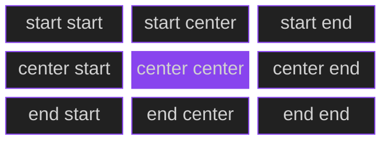

Cada caixa mostra o valor de `place-content` que leva a grade para aquele ponto do contêiner. O centro (`center center`) é o mesmo que escrever só `place-content: center`.

Veja também combinações de posição com distribuição:

| Declaração | Vertical | Horizontal |
| --- | --- | --- |
| `place-content: center` | centro | centro |
| `place-content: start center` | topo | centro |
| `place-content: center start` | centro | esquerda |
| `place-content: end end` | base | direita |
| `place-content: end left` | base | esquerda |
| `place-content: space-between` | entre as trilhas | entre as trilhas |
| `place-content: center space-evenly` | centro | espaço idêntico |
| `place-content: stretch space-evenly` | trilhas `auto` esticadas | espaço idêntico |
| `place-content: safe center` | centro, sem perder conteúdo | centro, sem perder conteúdo |

---

## 5. Exemplos de layouts e inspirações

Todos os exemplos podem ser colados em um arquivo `.html` ou em um editor online como o CodePen. Nos diagramas, os blocos roxos são as **colunas e linhas da grade**, e os espaços vazios são o **espaço livre** do contêiner.

### 5.1 Grade centralizada na tela

Útil para telas de login, páginas de manutenção e painéis com poucos cartões.

```html
<main class="palco">
  <div class="cartao">1</div>
  <div class="cartao">2</div>
  <div class="cartao">3</div>
</main>
```

```css
.palco {
  display: grid;
  grid-template-columns: repeat(3, 120px);
  grid-auto-rows: 120px;
  gap: 16px;
  min-height: 100vh;
  place-content: center;
}

.cartao {
  display: grid;
  place-items: center;
  background: #8844ee;
  color: #ffffff;
  border-radius: 8px;
}
```

**O que acontece:** a grade tem `3 × 120 + 2 × 16 = 392px` de largura e `120px` de altura. Como o contêiner tem `min-height: 100vh` e ocupa a largura da tela, sobra espaço nos dois eixos, e o `place-content: center` centraliza a grade. O `place-items: center` nos cartões só centraliza o número **dentro** de cada célula, o que mostra a diferença entre as duas propriedades.

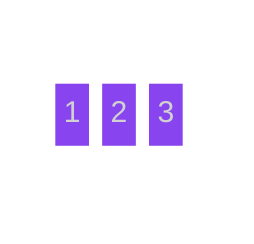

### 5.2 Quatro cantos com `space-between`

Útil para painéis com um elemento em cada canto, como jogos, dashboards e telas de quiosque.

```html
<div class="quadro">
  <div class="canto">1</div>
  <div class="canto">2</div>
  <div class="canto">3</div>
  <div class="canto">4</div>
</div>
```

```css
.quadro {
  display: grid;
  grid-template-columns: repeat(2, 140px);
  grid-template-rows: repeat(2, 90px);
  width: 480px;
  height: 320px;
  border: 2px dashed #8844ee;
  place-content: space-between;
}

.canto {
  display: grid;
  place-items: center;
  background: #212121;
  color: #ffffff;
  border: 2px solid #8844ee;
}
```

**O que acontece:** a primeira trilha encosta no início, a última no fim, e todo o espaço sobrando fica entre elas.

**A conta:** horizontalmente `480 − (2 × 140) = 200px` de espaço livre. Verticalmente `320 − (2 × 90) = 140px`. Como há duas trilhas por eixo, existe um único "entre" em cada eixo, que recebe todo o espaço.

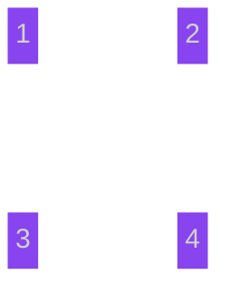

### 5.3 Botões no canto inferior direito

Útil para barras de ação, rodapés de diálogo e painéis de formulário.

```html
<div class="tela">
  <button>Cancelar</button>
  <button>Salvar</button>
</div>
```

```css
.tela {
  display: grid;
  grid-template-columns: repeat(2, 120px);
  grid-template-rows: 48px;
  gap: 12px;
  height: 300px;
  padding: 16px;
  border: 2px dashed #8844ee;
  place-content: end end;
}

button {
  background: #8844ee;
  color: #ffffff;
  border: 0;
  border-radius: 6px;
  cursor: pointer;
}
```

**O que acontece:** o primeiro `end` empurra a grade para a base (eixo vertical) e o segundo para a direita (eixo horizontal).

**Por que funciona:** o contêiner é um grid de bloco, então ocupa toda a largura disponível (há espaço horizontal), e a altura de `300px` cria espaço vertical. Sem a altura definida, o primeiro `end` não teria efeito.


### 5.4 Barra de ícones com `center space-evenly`

Útil para barras de ícones e menus em que cada eixo precisa de um comportamento diferente.

```html
<nav class="barra">
  <span>A</span>
  <span>B</span>
  <span>C</span>
  <span>D</span>
</nav>
```

```css
.barra {
  display: grid;
  grid-template-columns: repeat(4, 64px);
  grid-auto-rows: 64px;
  height: 200px;
  border: 2px dashed #8844ee;
  place-content: center space-evenly;
}

.barra span {
  display: grid;
  place-items: center;
  background: #212121;
  color: #ffffff;
  border: 2px solid #8844ee;
  border-radius: 50%;
}
```

**O que acontece:** verticalmente a única linha fica no centro (`center`). Horizontalmente, o espaço sobrando é dividido em partes idênticas antes, entre e depois dos quatro círculos (`space-evenly`).

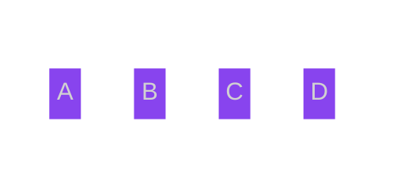

### 5.5 Seletor de alinhamento com classes

Útil para testar valores rapidamente: troque a classe do contêiner e veja o efeito.

```html
<div class="grade inicio">
  <div>1</div>
  <div>2</div>
  <div>3</div>
  <div>4</div>
</div>
```

```css
.grade {
  display: grid;
  grid-template-columns: repeat(2, 100px);
  grid-template-rows: repeat(2, 60px);
  gap: 8px;
  width: 400px;
  height: 250px;
  border: 2px dashed #8844ee;
}

.grade div {
  display: grid;
  place-items: center;
  background: #8844ee;
  color: #ffffff;
}

.inicio    { place-content: start; }
.centro    { place-content: center; }
.fim       { place-content: end; }
.espalhado { place-content: space-around; }
.uniforme  { place-content: space-evenly; }
```

**O que acontece:** o HTML usa `inicio`. Troque por `centro`, `fim`, `espalhado` ou `uniforme` e observe a grade se mover dentro do mesmo contêiner.

**A conta:** a grade tem `2 × 100 + 8 = 208px` de largura e `2 × 60 + 8 = 128px` de altura. O contêiner tem `400px` × `250px`, então sobram `192px` na horizontal e `122px` na vertical.

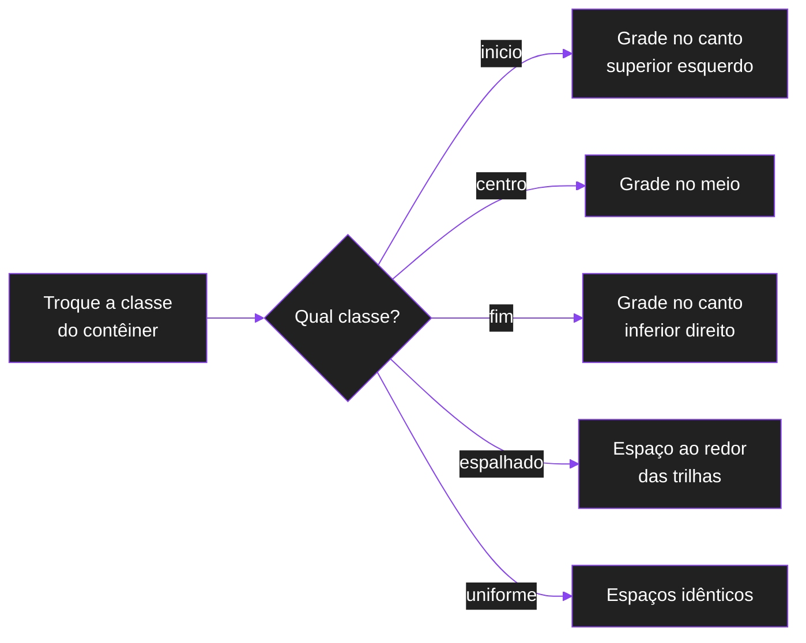

### 5.6 Tabuleiro de jogo centralizado

Um tabuleiro de tamanho fixo fica no meio da tela, qualquer que seja o tamanho da janela.

```css
.jogo {
  display: grid;
  min-height: 100vh;
  place-content: center;
}

.tabuleiro {
  display: grid;
  grid-template-columns: repeat(8, 60px);
  grid-template-rows: repeat(8, 60px);
}
```

Aqui o `.jogo` tem uma única célula com o tamanho `auto`. Por isso, o navegador **precisa do `place-content: center`**: sem ele, a linha esticaria até a altura toda (`stretch`), e o tabuleiro seria posicionado no topo, como item da célula.

> Repare que o `.tabuleiro` é, ao mesmo tempo, **item** do `.jogo` e **contêiner** de um outro Grid. Um elemento pode ter os dois papéis.

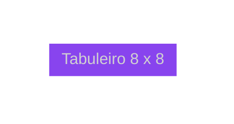

### 5.7 Cartões com espaço uniforme

Três cartões de largura fixa, com o mesmo espaço entre eles e nas laterais, e centralizados na vertical.

```css
.destaques {
  display: grid;
  grid-template-columns: repeat(3, 200px);
  grid-auto-rows: 160px;
  min-height: 300px;
  place-content: center space-evenly;
}
```

**O que acontece:** o `space-evenly` torna idênticos os quatro espaços horizontais (esquerda, entre os dois pares e direita). Em uma tela de `1000px`, sobram `400px`, ou seja, `100px` em cada um dos quatro espaços.

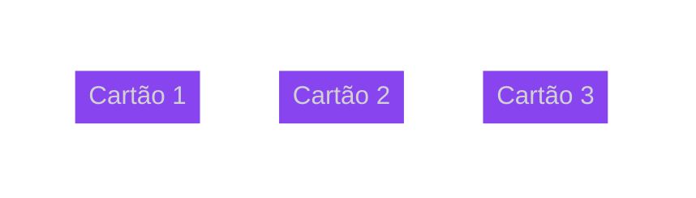

### 5.8 Colunas `auto` que se esticam

Quando as trilhas são `auto`, o valor padrão (ou `stretch`) as faz crescer para preencher o contêiner.

```css
.tabela-precos {
  display: grid;
  grid-template-columns: auto auto auto;
  width: 900px;
}
```

**O que acontece:** o espaço livre é dividido igualmente entre as três colunas `auto`, e elas passam a ocupar os `900px`. As larguras finais são: o tamanho do conteúdo de cada coluna mais uma parte igual do espaço livre.

Para **impedir** esse crescimento e manter as colunas do tamanho do conteúdo, mude o valor:

```css
.tabela-precos {
  place-content: start;
}
```


### 5.9 `place-content` e `place-items` juntos

Os dois centralizam, mas **coisas diferentes**: a grade dentro do contêiner e os itens dentro das células.

```css
.container {
  display: grid;
  grid-template-columns: repeat(3, 160px);
  grid-auto-rows: 120px;
  min-height: 100vh;
  place-content: center;
  place-items: center;
}
```

- `place-content: center` leva a grade para o meio da tela.
- `place-items: center` leva cada item para o meio da sua célula de `160px` × `120px`.

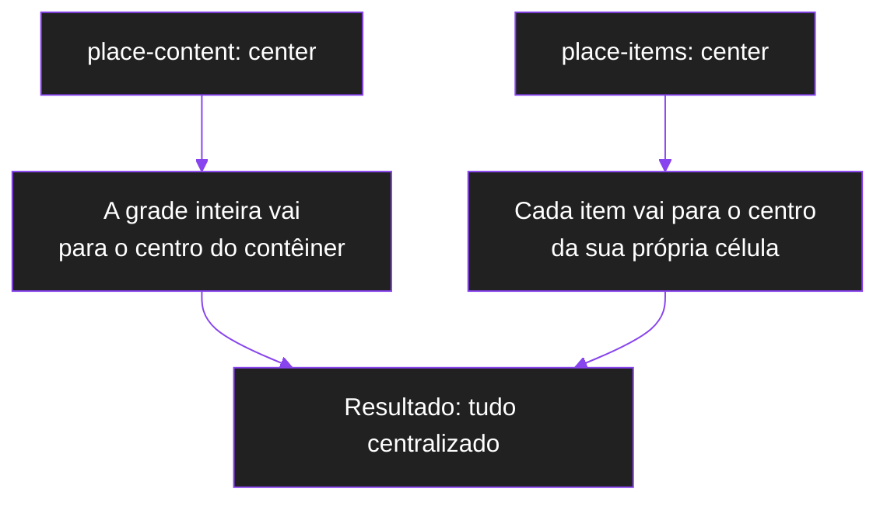

### 5.10 Página de erro 404

```html
<main class="erro">
  <h1>404</h1>
  <p>Página não encontrada</p>
  <a href="/">Voltar ao início</a>
</main>
```

```css
.erro {
  display: grid;
  min-height: 100vh;
  place-content: center;
  justify-items: center;
  gap: 12px;
  text-align: center;
}
```

**O que acontece:** o `place-content: center` leva o bloco de três linhas para o meio da tela. O `justify-items: center` centraliza cada item na coluna, já que a coluna única é `auto` e tem a largura do conteúdo mais largo.


### 5.11 Galeria responsiva que continua centralizada

```css
.galeria {
  display: grid;
  grid-template-columns: repeat(auto-fit, minmax(160px, 200px));
  gap: 16px;
  place-content: center;
}
```

**O que acontece:** o `auto-fit` cria quantas colunas couberem, cada uma entre `160px` e `200px`. As colunas crescem até o máximo de `200px`, e o **que sobrar** fica livre. Esse espaço é dividido igualmente pelas laterais, e a galeria fica centralizada.

**Por que não usar `1fr`:** com `minmax(160px, 1fr)`, as colunas consumiriam todo o espaço, e o `place-content` não teria o que centralizar (erro 1).


### 5.12 Mensagens coladas na base

Em uma janela de chat, as mensagens mais novas aparecem na parte de baixo, e o espaço vazio fica no topo.

```css
.chat {
  display: grid;
  grid-template-columns: 1fr;
  gap: 8px;
  height: 400px;
  overflow: auto;
  place-content: end stretch;
}
```

**O que acontece:** o `end` no eixo vertical empurra todas as linhas para a base. O `stretch` no eixo horizontal é o padrão e não muda nada, já que a coluna é `1fr`. As linhas têm altura `auto` (tamanho de cada mensagem), e o espaço livre fica **acima** da primeira.

> Se houver mais mensagens do que cabem em `400px`, a grade fica maior que o contêiner. Nesse caso, prefira `place-content: safe end stretch` ou confira o comportamento da rolagem, porque a parte superior pode ficar fora do alcance.

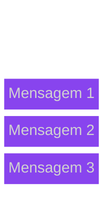

### 5.13 Grade larga com `safe center`

Uma tabela de colunas fixas dentro de um contêiner estreito, com rolagem horizontal.

```css
.tabela {
  display: grid;
  grid-template-columns: repeat(6, 200px);
  width: 500px;
  overflow-x: auto;
  place-content: safe center;
}
```

**O que acontece:** a grade tem `1200px`, e o contêiner `500px`. O espaço livre é **negativo** (`−700px`).

- Com `center`, o excesso seria dividido nos dois lados, e a parte da esquerda ficaria **inalcançável pela rolagem**.
- Com `safe center`, o navegador recua para `start`: a grade começa na borda esquerda, e a rolagem alcança tudo.

Se a grade **couber** no contêiner, o `safe center` volta a centralizar normalmente.

```text
center (sem safe)                   safe center
┌──────────────────┐                ┌──────────────────┐
│ conteúdo cortado │                │ início visível   │
│ à esquerda e à   │                │ e o resto é      │
│ direita          │                │ alcançável       │
└──────────────────┘                └──────────────────┘
```

---

## 6. Principais erros e confusões

Esta é a seção mais importante da documentação. Quando a propriedade parece "não funcionar", **quase nunca é um bug do navegador**: existe uma razão lógica. As causas se dividem em três grupos:

| Grupo | Pergunta que ele responde |
| --- | --- |
| **A. Sem espaço livre** | Existe espaço sobrando para distribuir? |
| **B. Valor sem diferença** | O valor escolhido muda algo com essas trilhas? |
| **C. Declaração ineficaz** | O navegador está de fato aplicando a regra? |

### 6.1 Como diagnosticar

1. Abra o **DevTools** (F12) e selecione o contêiner.
2. Na aba de estilos, procure a declaração `place-content`:
   - **Riscada** ou com ícone de alerta: valor inválido ou sobrescrito por outra regra.
   - **Esmaecida** com uma dica ao passar o mouse: propriedade inativa. A dica costuma explicar o motivo.
3. Ative a sobreposição de grade (no Chrome, clique no selo `grid` ao lado do elemento na árvore HTML; no Firefox, use o inspetor de grid). Ela desenha as trilhas e mostra visualmente **quanto espaço sobra**.
4. Calcule o espaço livre com a fórmula da seção 1.2.

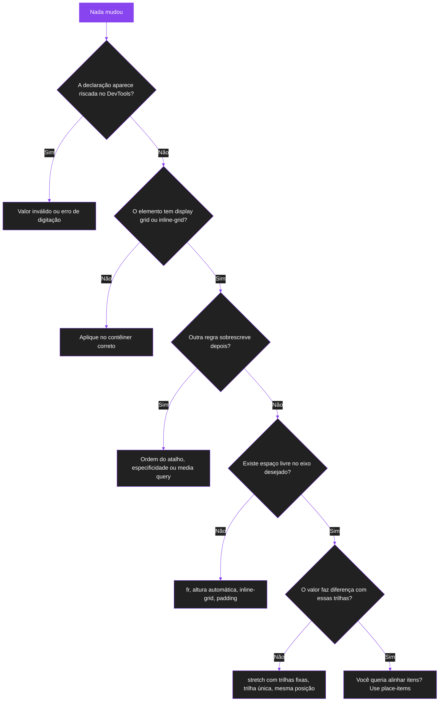

### 6.2 Grupo A: não existe espaço livre

Se o espaço livre é **zero**, mover a grade é impossível, porque ela já preenche o contêiner.

#### Erro 1: trilhas com `fr`

**Sintoma:** `place-content: center` não centraliza nada na horizontal.

```css
.container {
  display: grid;
  grid-template-columns: repeat(3, 1fr);
  place-content: center;
}
```

**Por que acontece:** a unidade `fr` significa "fração do espaço livre". As trilhas `fr` **consomem todo o espaço livre** antes de o `place-content` ser considerado. Resultado: sobra `0`, e não há o que alinhar ou distribuir.

**Armadilhas parecidas** que também consomem o espaço:

```css
grid-template-columns: repeat(auto-fit, minmax(100px, 1fr));
```

```css
grid-template-columns: 30% 40% 30%;
```

No primeiro, o `1fr` no máximo do `minmax` faz as colunas crescerem até preencher tudo. No segundo, as porcentagens somam `100%`.

**Correção 1:** use tamanhos fixos.

```css
.container {
  display: grid;
  grid-template-columns: repeat(3, 120px);
  place-content: center;
}
```

**Correção 2:** limite o crescimento com um máximo fixo no `minmax`.

```css
.container {
  display: grid;
  grid-template-columns: repeat(3, minmax(80px, 120px));
  place-content: center;
}
```

Aqui as colunas crescem até `120px` e param (passo 2 da seção 1.6). O que sobrar vira espaço livre, e o `place-content` volta a funcionar.

#### Erro 2: contêiner sem altura definida

**Sintoma:** o `place-content` funciona na horizontal, mas **não centraliza na vertical**.

```css
.container {
  display: grid;
  grid-template-columns: repeat(3, 120px);
  place-content: center;
}
```

**Por que acontece:** com `height: auto` (o padrão), a altura do contêiner é calculada **a partir do conteúdo**. Ele fica exatamente do tamanho das linhas, então não há espaço livre vertical.

**Variação comum:** usar `height: 100%`.

```css
.container {
  display: grid;
  height: 100%;
  place-content: center;
}
```

Uma porcentagem de altura só funciona se o **elemento pai tem altura definida**. Se o pai está com `height: auto`, o `100%` é tratado como `auto`, e o problema continua.

**Correção:** dê uma altura real ao contêiner.

```css
.container {
  display: grid;
  min-height: 100vh;
  place-content: center;
}
```

Em celulares, a barra de endereço do navegador pode fazer `100vh` ser maior que a área visível. Nesses casos, `min-height: 100dvh` costuma ser mais preciso.

#### Erro 3: `inline-grid`, grid encolhido ou sem largura

**Sintoma:** não há efeito horizontal, mesmo com colunas de tamanho fixo.

```css
.container {
  display: inline-grid;
  grid-template-columns: repeat(3, 120px);
  place-content: center;
}
```

**Por que acontece:** `inline-grid` (e também um grid com `position: absolute`, com `float`, ou que é item de um contêiner flex sem `flex-grow`) tem largura **ajustada ao conteúdo**. Ele se encolhe até o tamanho da própria grade, e o espaço livre horizontal vira zero.

**Correção:** use `display: grid` (que ocupa toda a largura do pai) ou defina uma largura.

```css
.container {
  display: grid;
  grid-template-columns: repeat(3, 120px);
  place-content: center;
}
```

#### Erro 4: esquecer que `padding`, `border` e `gap` entram na conta

**Sintoma:** o espaço "some" ou as distâncias não batem com o esperado.

**Por que acontece:**

- O espaço livre é medido na **área de conteúdo**: `padding` e `border` reduzem esse espaço.
- Com `box-sizing: content-box` (o padrão do navegador), o `width` **não inclui** o `padding`, então o contêiner fica maior do que você calculou. Com `border-box`, o `padding` sai de dentro do `width`.
- O `gap` conta como parte da grade. A grade fica maior, e sobra menos espaço.

**Exemplo:**

```css
.container {
  display: grid;
  grid-template-columns: repeat(3, 100px);
  gap: 40px;
  width: 380px;
  padding: 10px;
  box-sizing: border-box;
  place-content: center;
}
```

| Etapa | Cálculo | Resultado |
| --- | --- | --- |
| Área de conteúdo | `380 − 10 − 10` | `360px` |
| Grade | `3 × 100 + 2 × 40` | `380px` |
| Espaço livre | `360 − 380` | `−20px` (negativo) |

A grade é maior que a área disponível: ela **estoura** (erro 11).

#### Erro 5: trilhas vazias continuam ocupando espaço

**Sintoma:** a grade "parece" pequena, mas o `place-content` se comporta como se fosse maior.

```css
.container {
  display: grid;
  grid-template-columns: repeat(4, 100px);
  place-content: center;
}
```

Se houver apenas dois itens, você vê duas colunas preenchidas. Mas as **quatro** colunas existem e ocupam `400px`. O `place-content` centraliza a grade de `400px`, e não os dois itens visíveis.

**Por que acontece:** trilhas **explícitas** (declaradas em `grid-template-*`) têm tamanho mesmo sem itens.

**Correção:** com `auto-fit`, o navegador colapsa as trilhas vazias geradas por `repeat`.

```css
.container {
  display: grid;
  grid-template-columns: repeat(auto-fit, 100px);
  place-content: center;
}
```

Com `auto-fit`, as colunas vazias têm tamanho `0`, e a grade centraliza apenas as colunas com itens.

#### Erro 6: trilhas `auto` esticadas pelo valor padrão

**Sintoma:** a grade parece preencher o contêiner e, ao aplicar `place-content: center`, as colunas **encolhem** de repente.

```css
.container {
  display: grid;
  grid-template-columns: auto auto auto;
  width: 600px;
}
```

**Por que acontece:** o valor padrão (`normal`) se comporta como `stretch` no grid. As trilhas `auto` **crescem igualmente** até ocuparem todo o contêiner, então o espaço livre é consumido. Ao usar `center`, `start`, `end` ou `space-*`, o `stretch` deixa de valer, e as trilhas voltam ao tamanho do conteúdo.

**Em outras palavras:** `place-content` com um valor de posição pode **mudar o tamanho das trilhas `auto`**, e não apenas a posição. Isso surpreende muita gente.

```css
.container {
  grid-template-columns: auto auto auto;
  place-content: center;
}
```

Agora as colunas têm a largura do próprio conteúdo e ficam centralizadas.

#### Erro 7: esquecer das trilhas implícitas

**Sintoma:** a grade parece maior do que você declarou, e a distância até as bordas não bate com a conta.

```css
.container {
  display: grid;
  grid-template-columns: repeat(2, 100px);
  grid-template-rows: 100px;
  grid-auto-rows: 100px;
  height: 400px;
  place-content: center;
}
```

Se houver 6 itens, o Grid cria **mais duas linhas implícitas** (`grid-auto-rows`), e a grade passa a ter `3 × 100 = 300px` de altura, e não `100px`. O `place-content` centraliza a grade **com todas as linhas**, inclusive as implícitas.

**Correção:** conte as trilhas implícitas na hora de calcular o espaço livre. O DevTools mostra todas elas na sobreposição de grade.

---

### 6.3 Grupo B: o valor escolhido não muda nada

#### Erro 8: `stretch` com trilhas que não são `auto`

**Sintoma:** `place-content: stretch` (ou o padrão) não altera a grade.

```css
.container {
  display: grid;
  grid-template-columns: repeat(3, 100px);
  place-content: stretch;
}
```

**Por que acontece:** segundo a MDN, **apenas trilhas de tamanho `auto`** podem ser esticadas pelo `align-content` e pelo `justify-content`. Trilhas fixas (`100px`) e `fr` não crescem.

**Observação:** como `normal` já se comporta como `stretch` no grid, escrever `place-content: stretch` explicitamente costuma **não mudar nada** em relação ao padrão.

#### Erro 9: o valor já é a posição natural

**Sintoma:** `place-content: start` não muda nada em um contêiner sem espaço sobrando, ou em uma grade que já está no início.

**Por que acontece:** `start` leva a grade ao início, e a grade já está no início porque o contêiner não tem espaço extra, ou porque as trilhas `auto` esticadas já ocupam tudo. O valor está correto, mas **não há diferença visual para mostrar**.

**Como testar:** troque temporariamente por `end` ou `center` e veja se o comportamento muda. Se mudar, o valor anterior estava correto, só não tinha efeito visível.

#### Erro 10: trilha única e os valores de distribuição

**Sintoma:** `space-between` não separa nada.

```css
.container {
  display: grid;
  grid-template-columns: 120px;
  grid-template-rows: repeat(3, 60px);
  height: 400px;
  place-content: space-between;
}
```

**Por que acontece:** na horizontal existe **uma única coluna**. Não há "entre" colunas, então o navegador usa o alinhamento de reserva (`start`). Na vertical, existem três linhas e a distribuição funciona normalmente.

**Para lembrar:** `space-between` precisa de **duas ou mais trilhas no eixo**, mais espaço livre positivo.

#### Erro 11: grade maior que o contêiner (overflow)

**Sintoma:** com `center`, a grade fica cortada em **ambos os lados**, e a parte inicial pode ficar inalcançável pela rolagem.

```css
.container {
  display: grid;
  grid-template-columns: repeat(3, 200px);
  width: 400px;
  overflow: auto;
  place-content: center;
}
```

**Por que acontece:** a grade tem `600px` e o contêiner `400px`. O espaço livre é **negativo** (`−200px`). Com `center`, o excesso é dividido para os dois lados: `100px` vazam para a esquerda e `100px` para a direita. O que vaza à esquerda da origem não é alcançável pela barra de rolagem, e o conteúdo parece "cortado".

**Correção:** use `safe`, que cai para `start` quando há risco de perder conteúdo.

```css
.container {
  display: grid;
  grid-template-columns: repeat(3, 200px);
  width: 400px;
  overflow: auto;
  place-content: safe center;
}
```

> ⚠️ O oposto é `unsafe center`, que respeita o `center` mesmo com perda de conteúdo. Use apenas quando for intencional.

Os valores de distribuição também recorrem a alinhamentos de reserva quando o espaço é negativo, então não se espalham além do contêiner.

---

### 6.4 Grupo C: a declaração não está sendo aplicada

#### Erro 12: valor inválido

**Sintoma:** nada acontece, e o DevTools mostra a declaração riscada.

```css
.container {
  place-content: left;
}
```

**Por que acontece:** com um único valor, ele é usado para **os dois eixos**. Como `align-content` (eixo vertical) **não aceita** `left` nem `right`, o valor é inválido para um dos eixos, e a declaração inteira é descartada.

**Correção:** informe o par completo.

```css
.container {
  place-content: start left;
}
```

**Outros exemplos de valor único inválido:** `baseline` e `first baseline` sozinhos, porque a MDN indica que `justify-content` não aceita valores de baseline. Para usar baseline, informe o segundo valor: `place-content: baseline center;`. Veja a tabela da seção 2.4.

#### Erro 13: o atalho sobrescrevendo (ou sendo sobrescrito)

**Sintoma:** um valor "some" ou muda sozinho.

```css
.container {
  justify-content: space-between;
  place-content: center;
}
```

O `place-content`, por vir depois, **sobrescreve também o `justify-content`**. O `space-between` é perdido.

**O mesmo raciocínio vale para:**

- uma regra com **especificidade maior** (por exemplo, `.pagina .container` contra `.container`);
- uma regra dentro de `@media` que reaparece em telas menores;
- uma regra em uma `@layer` com prioridade maior.

**Dica:** no DevTools, a declaração vencida aparece riscada, e você vê qual regra a substituiu.

#### Erro 14: o elemento não é um contêiner grid

**Sintoma:** nada acontece, e o DevTools pode mostrar a propriedade esmaecida (inativa).

```css
.container {
  place-content: center;
}
```

**Por que acontece:** sem `display: grid` (ou `inline-grid`), o elemento é um contêiner de bloco. A propriedade é definida também para contêineres de bloco, mas, na prática, o `justify-content` só tem efeito em contêineres flex, grid e multicoluna, e o suporte do `align-content` em contêineres de bloco é mais recente. Não conte com o efeito que você vê em um grid, e confira a tabela de compatibilidade da MDN.

**Causas comuns:**

- esquecer o `display: grid`;
- erro de digitação, como `display: gird`;
- uma regra posterior trocando o `display` (por exemplo, para `block` em uma media query).

#### Erro 15: aplicar a propriedade no item, e não no contêiner

**Sintoma:** você escreveu `place-content` no elemento filho esperando mover **ele mesmo** dentro da grade.

```css
.item {
  place-content: center;
}
```

**Por que não funciona:** `place-content` age sobre as **trilhas do próprio elemento**. Um item comum não é um contêiner grid, e mesmo que fosse, a propriedade moveria as trilhas **dele**, e não ele mesmo.

**Correção:** para mover o item dentro da própria célula, use `place-self`.

```css
.item {
  place-self: center;
}
```

#### Erro 16: confundir `place-content` com `place-items`

Este é o erro conceitual mais frequente. Veja os dois lado a lado:

```css
.container {
  display: grid;
  grid-template-columns: repeat(3, 1fr);
  grid-auto-rows: 100px;
  place-content: center;
}
```

Aqui o `place-content` não faz nada visível (as colunas `1fr` ocupam todo o espaço). Os itens continuam esticados dentro das células.

```css
.container {
  display: grid;
  grid-template-columns: repeat(3, 1fr);
  grid-auto-rows: 100px;
  place-items: center;
}
```

Agora cada item é **centralizado dentro da sua célula**, mesmo com `1fr`.

| Quero... | Use |
| --- | --- |
| Mover a grade inteira no contêiner | `place-content` |
| Centralizar todos os itens nas suas células | `place-items` |
| Centralizar um único item na sua célula | `place-self` (no item) |
| Centralizar a grade **e** os itens | os dois, em conjunto (exemplo 5.9) |

#### Erro 17: eixos trocados pelo `writing-mode`

**Sintoma:** o 1º valor move na horizontal, e o 2º na vertical, o oposto do esperado.

**Por que acontece:** as propriedades seguem os eixos de **bloco** e **inline**. Em modos de escrita verticais (`writing-mode: vertical-rl`, por exemplo), esses eixos giram, e `align-content` passa a ser horizontal.

**Correção:** se o site não usa escrita vertical, verifique se algum `writing-mode` foi herdado sem querer.

### 6.5 Tabela de sintomas

| Sintoma | Causa mais provável | Correção |
| --- | --- | --- |
| Não centraliza na horizontal | colunas em `fr`, `%` ou `minmax(..., 1fr)` | tamanhos fixos ou `minmax` com máximo fixo |
| Não centraliza na vertical | altura automática ou `height: 100%` sem pai com altura | `min-height: 100vh` ou `100dvh` |
| Nenhum efeito horizontal em `inline-grid` | largura ajustada ao conteúdo | usar `display: grid` ou definir `width` |
| Distâncias diferentes do esperado | `padding`, `border` ou `gap` não contabilizados | refazer a conta do espaço livre |
| Centraliza mais trilhas do que os itens visíveis | trilhas vazias ocupam espaço | `repeat(auto-fit, ...)` |
| Colunas encolhem ao usar `center` | trilhas `auto` estavam esticadas pelo padrão | esperado: defina tamanhos fixos se quiser controlar |
| Grade maior do que declarei | trilhas implícitas entram na conta | conferir `grid-auto-rows` e `grid-auto-columns` |
| `stretch` não muda nada | trilhas não são `auto` | usar trilhas `auto` ou outro valor |
| `space-between` não separa | trilha única no eixo | precisa de 2 ou mais trilhas |
| Grade cortada dos dois lados | overflow com `center` | `safe center` |
| Declaração riscada no DevTools | valor inválido ou sobrescrito | revisar sintaxe e ordem |
| Propriedade esmaecida | elemento não é contêiner grid | aplicar `display: grid` no elemento certo |
| Item não se move | propriedade aplicada no item | usar `place-self` ou `place-items` |
| Itens esticados nas células | confusão com `place-items` | `place-items` para itens |

### 6.6 Checklist rápido antes de pedir ajuda

1. O elemento tem `display: grid`?
2. A propriedade está no **contêiner**?
3. O valor é válido para os **dois** eixos (se foi usado um só)?
4. Alguma regra posterior reescreve `align-content` ou `justify-content`?
5. A grade é **menor** que a área de conteúdo, em cada eixo?
6. As trilhas são fixas (e não `fr` ou `%`)?
7. O contêiner tem altura real?
8. As trilhas implícitas foram contadas?
9. O valor escolhido faz diferença com essas trilhas?

---

## 7. Tabela de fixação

### 7.1 Pergunta e resposta

| Pergunta | Resposta |
| --- | --- |
| O que o `place-content` abrevia? | `align-content` e `justify-content` |
| Qual é a ordem dos valores? | 1º `align-content` (vertical), 2º `justify-content` (horizontal) |
| O que acontece com um valor só? | ele é aplicado aos dois eixos, se for válido para ambos |
| Onde a propriedade é declarada? | no contêiner |
| O que ela move? | a grade inteira (as trilhas) |
| Quando ela tem efeito? | quando há espaço livre no contêiner |
| Como calcular o espaço livre? | área de conteúdo do contêiner − (trilhas + gaps) |
| Qual é o valor inicial? | `normal` (em grid, comporta-se como `stretch`) |
| Ela é herdada? | não |
| `left` e `right` valem no 1º valor? | não, só no eixo horizontal (2º valor) |
| `baseline` vale no 2º valor? | não, só no 1º (`align-content`) |
| `flex-start` em grid funciona? | sim, é tratado como `start` |
| `fr` e `place-content` combinam? | não, `fr` consome o espaço livre |
| Quais trilhas o `stretch` aumenta? | apenas as trilhas com máximo `auto` |
| O `gap` some quando uso `space-between`? | não, o espaço distribuído é somado ao `gap` |
| O que `safe` faz? | alinha como `start` se houver risco de perder conteúdo |
| `place-content` ou `place-items`? | grade inteira ou itens dentro das células |

### 7.2 Valores e o que cada um muda

| Valor | O que faz | Move a grade? | Muda o tamanho? |
| --- | --- | --- | --- |
| `normal` | no Grid, age como `stretch` | não | trilhas `auto` crescem |
| `start` | início do eixo | sim | trilhas `auto` voltam ao tamanho do conteúdo |
| `end` | final do eixo | sim | idem |
| `center` | centro do eixo | sim | idem |
| `flex-start` / `flex-end` | no Grid, iguais a `start` / `end` | igual | igual |
| `left` / `right` | esquerda/direita físicas, só na 2ª posição | sim | idem |
| `stretch` | faz as trilhas `auto` crescerem | não | sim |
| `space-between` | espaço só entre as trilhas | sim | trilhas `auto` voltam ao tamanho do conteúdo |
| `space-around` | metade do espaço nas pontas | sim | idem |
| `space-evenly` | espaços idênticos em todos os intervalos | sim | idem |
| `baseline` / `first baseline` | alinha pela primeira linha de base (1ª posição) | raramente visível | não |
| `last baseline` | alinha pela última linha de base (1ª posição) | raramente visível | não |
| `safe` + posição | evita perder conteúdo com overflow | só com overflow | não |
| `unsafe` + posição | mantém a posição, mesmo com overflow | só com overflow | não |
| globais | definem de onde o valor vem | sem efeito próprio | sem efeito próprio |

### 7.3 Quando o valor tem ou não efeito visível

| Situação | `start` / `end` / `center` | `space-*` | `stretch` |
| --- | --- | --- | --- |
| Sobra espaço, trilhas fixas | move a grade | distribui | nada muda |
| Sobra espaço, trilhas `auto` | move e **encolhe** as trilhas | distribui e encolhe as trilhas | trilhas crescem |
| Trilhas `fr` | nada muda | nada muda | nada muda |
| Espaço livre zero | nada muda | nada muda | nada muda |
| Espaço livre negativo | pode cortar conteúdo (use `safe`) | alinhamento de reserva | alinhamento de reserva |
| Trilha única no eixo | move normalmente | `space-between` vira `start`, os outros viram `center` | trilha `auto` cresce |

### 7.4 Família de propriedades

| Propriedade | Aplicada em | O que alinha |
| --- | --- | --- |
| `place-content` | contêiner | a grade inteira (as trilhas) |
| `align-content` | contêiner | a grade no eixo block |
| `justify-content` | contêiner | a grade no eixo inline |
| `place-items` | contêiner | todos os itens dentro das suas células |
| `place-self` | item | um item dentro da sua célula |

---

## 8. Resumo

- `place-content` é um atalho para `align-content` e `justify-content`.
- O primeiro valor controla o eixo **vertical** e o segundo o eixo **horizontal**.
- Com um único valor, ele vale para os dois eixos (se for válido para ambos). Se não for, a declaração inteira é descartada.
- A propriedade é declarada no **contêiner** e move a **grade inteira** (as trilhas), não os itens individuais.
- Tudo depende do **espaço livre**: área de conteúdo do contêiner menos a soma das trilhas e dos gaps, em cada eixo.
- O navegador dimensiona as trilhas **antes** do `place-content`: `fr` e trilhas que crescem até um máximo consomem o espaço primeiro.
- Sem espaço livre, não há efeito: `fr`, porcentagens, altura automática e `inline-grid` são as causas mais comuns.
- Com valores de posição ou de distribuição, as trilhas `auto` deixam de ser esticadas e voltam ao tamanho do conteúdo.
- O `stretch` só aumenta trilhas com máximo `auto`. Em trilhas fixas ou `fr`, não faz diferença.
- Os valores `space-*` precisam de espaço livre positivo, e o `space-between` de duas ou mais trilhas. Caso contrário, usam um alinhamento de reserva.
- Se a grade for maior que o contêiner, `center` pode cortar o conteúdo. Use `safe center`.
- O atalho sobrescreve os dois valores. A ordem das declarações importa.
- Para alinhar itens dentro das células, use `place-items` ou `place-self`.

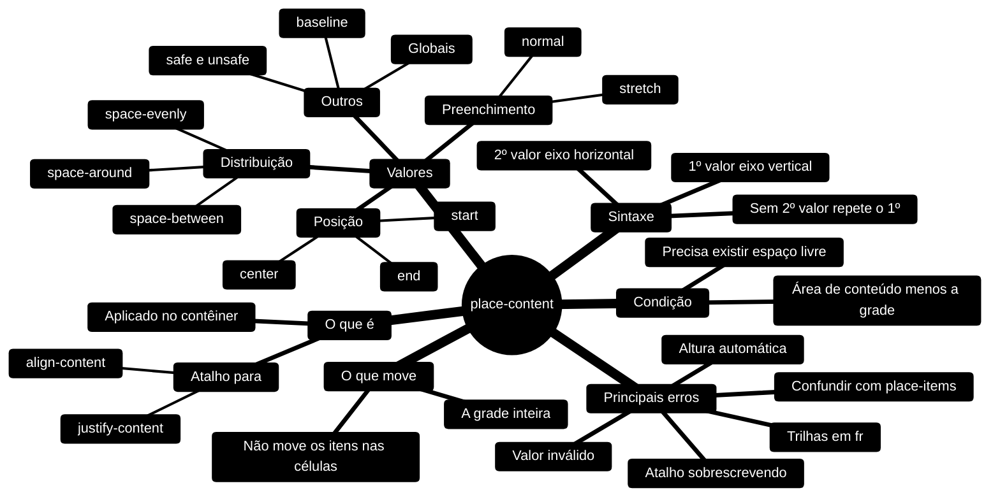

---

## 9. Referências

- [MDN — `place-content`](https://developer.mozilla.org/pt-BR/docs/Web/CSS/place-content)
- [MDN — `align-content`](https://developer.mozilla.org/pt-BR/docs/Web/CSS/align-content)
- [MDN — `justify-content`](https://developer.mozilla.org/pt-BR/docs/Web/CSS/justify-content)
- [MDN — `place-items`](https://developer.mozilla.org/pt-BR/docs/Web/CSS/place-items)
- [MDN — `place-self`](https://developer.mozilla.org/pt-BR/docs/Web/CSS/place-self)
- [MDN — Alinhamento de caixas em grid layout](https://developer.mozilla.org/pt-BR/docs/Web/CSS/CSS_grid_layout/Box_alignment_in_grid_layout)
- [W3C — CSS Box Alignment Module Level 3 (`place-content`)](https://drafts.csswg.org/css-align/#place-content)

---

[Gabriel Felipe de Oliveira Rateiro](https://github.com/gabrielfelipeoliveira55)
