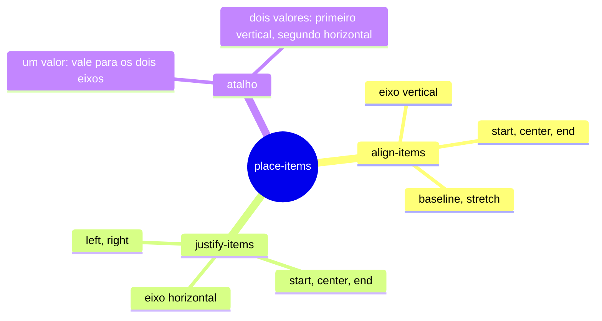

# CSS Grid Layout: `place-items`

A propriedade `place-items` é um **atalho** (em inglês, *shorthand*) que define, ao mesmo tempo, o alinhamento dos itens dentro das suas células do grid nos dois eixos. Ela junta duas propriedades: `align-items`, que alinha no eixo vertical, e `justify-items`, que alinha no eixo horizontal. Em vez de escrever as duas, você escreve uma só.

> Exemplo rápido: para centralizar um elemento tanto na vertical quanto na horizontal dentro do seu container, basta uma linha.

```css
.container {
  display: grid;
  place-items: center;
}
```

---

## Índice

1. [O que é e como utilizar `place-items`](#o-que-é-e-como-utilizar-place-items)
2. [Syntax](#syntax)
3. [Para que serve cada padrão de elemento](#para-que-serve-cada-padrão-de-elemento)
4. [Uma breve revisão: `align-content` e `justify-content`](#uma-breve-revisão-align-content-e-justify-content)
5. [Valores](#valores)
6. [Visualizando o conceito](#visualizando-o-conceito)
7. [Exemplos de layouts](#exemplos-de-layouts)
8. [Principais erros e como evitá-los](#principais-erros-e-como-evitá-los)
9. [Tabela de fixação](#tabela-de-fixação)
10. [Resumo](#resumo)

---

## O que é e como utilizar `place-items`

Para entender `place-items`, primeiro é preciso entender duas ideias: **grid** e **eixos**.

Um **grid** (grade, em português) é um sistema de layout do CSS que divide um elemento em linhas e colunas, formando células. Os elementos filhos são colocados dentro dessas células. O elemento que recebe `display: grid` é chamado de **container** (ou *grid container*), e os filhos diretos são os **itens** (*grid items*).

Cada célula do grid é preenchida por um item. Quando o item é menor que a célula, surge a pergunta: onde ele deve ficar dentro dela? É exatamente isso que `place-items` responde.

Os **eixos** são as direções de referência do layout:

- **Eixo de bloco (block axis):** é a direção vertical em textos escritos da esquerda para a direita, de cima para baixo. A propriedade que controla esse eixo para itens de grid é o `align-items`. O nome "align" (alinhar) vem da ideia de alinhamento vertical.
- **Eixo em linha (inline axis):** é a direção horizontal, a mesma em que o texto corre. A propriedade que controla esse eixo é o `justify-items`. O nome "justify" (justificar) vem da ideia de posicionamento horizontal.

Assim, `place-items` nada mais é que a combinação dessas duas:

```css
/* Forma abreviada */
place-items: center start;

/* Equivale a */
align-items: center;   /* eixo vertical */
justify-items: start;  /* eixo horizontal */
```

**Como usar, na prática:**

1. Defina o container com `display: grid`.
2. Escreva `place-items` com um ou dois valores.
3. Os filhos diretos do container serão alinhados dentro de suas células.

**Para que serve:** `place-items` é útil sempre que você quer controlar o posicionamento de vários itens de uma só vez, sem precisar mexer em cada um individualmente. É muito usado para centralizar conteúdos, alinhar ícones, organizar cards e criar overlays (camadas sobre a tela, como modais).

**Um detalhe importante:** `place-items` define o padrão para **todos** os itens do grid. Se um item específico precisar de outro alinhamento, use a propriedade `place-self` nele, que tem efeito sobre aquele item apenas.

---

## Syntax

A sintaxe básica é:

```css
place-items: <align-items> <justify-items>?;
```

- O **primeiro valor** define o `align-items`, ou seja, o alinhamento vertical.
- O **segundo valor** (opcional) define o `justify-items`, ou seja, o alinhamento horizontal.
- Se você escrever **apenas um valor**, ele será usado nos dois eixos. Por isso `place-items: center` centraliza nas duas direções.

O exemplo mais clássico de centralização:

```css
.center-inside-of-me {
  display: grid;
  place-items: center;
}
```

Esse código faz o seguinte: o elemento `.center-inside-of-me` vira um grid, e seu filho (ou filhos) ficam centralizados tanto na vertical quanto na horizontal dentro de cada célula. Como o grid tem uma única célula quando você não define colunas e linhas, o efeito é centralizar o conteúdo dentro do próprio container.

**Observação importante:** para que a centralização vertical apareça de forma visível, o container precisa ter uma altura definida (por exemplo, `height: 300px`) ou ocupar uma área maior que o conteúdo. Caso contrário, ele se ajusta ao tamanho do próprio filho e não há espaço para centralizar.

---

## Para que serve cada padrão de elemento

A propriedade `place-items` se aplica aos seguintes tipos de caixas:

- **Caixas de nível de bloco:** elementos como `div`, `section` e `p`, que ocupam a largura disponível. Quando eles são itens de um grid, `place-items` controla como se encaixam nas células.
- **Caixas absolutamente posicionadas:** elementos com `position: absolute` ou `position: fixed`. Eles são retirados do fluxo normal da página, e o alinhamento passa a ser feito dentro da área de referência deles. Isso permite, por exemplo, centralizar um modal na tela.
- **Posição estática de caixas posicionadas de forma absoluta:** é a posição que o elemento absoluto teria se não estivesse retirado do fluxo. Quando um filho absoluto de um grid não tem `top`, `left` ou outras posições definidas, o `place-items` decide onde ele fica dentro do grid. Esse é um detalhe avançado, mas útil em alguns layouts de sobreposição.
- **Células de tabela:** elementos `td` e `th`, quando a tabela usa `display: grid` ou outro modo de layout semelhante, também são alinhados por essa propriedade.

Na maior parte do dia a dia, você vai usar `place-items` com `div` e outros blocos dentro de um grid, então os três primeiros itens da lista são os mais importantes.

---

## Uma breve revisão: `align-content` e `justify-content`

Essas duas propriedades são parecidas com `place-items`, mas com uma diferença fundamental que confunde muita gente.

- **`align-content` e `justify-content`** controlam o **conjunto de linhas e colunas** do grid dentro do container. Elas decidem como o "bloco inteiro" de trilhas se distribui quando sobra espaço livre no container. Por exemplo, `justify-content: center` centraliza o conjunto de colunas no container.
- **`align-items` e `justify-items`** controlam os **itens individuais** dentro das suas próprias células.

Em resumo: `*-content` organiza o grid no container, e `*-items` organiza os itens dentro das células. Já `place-items` é o atalho para `align-items` e `justify-items`, e `place-content` é o atalho para `align-content` e `justify-content`.

```css
.grid {
  display: grid;
  height: 400px;
  grid-template-columns: 100px 100px;
  grid-template-rows: 100px 100px;

  /* Organiza o conjunto de linhas e colunas dentro do container */
  place-content: center;

  /* Alinha cada item dentro da sua célula */
  place-items: start;
}
```

Por isso, o conteúdo do `place-content` aparece como um bloco centralizado, enquanto `place-items` decide onde cada item se posiciona dentro da própria célula.

---

## Valores

A propriedade aceita valores de alinhamento usados também em `align-items` e `justify-items`. Os exemplos abaixo foram extraídos da documentação do MDN, com comentários explicativos.

### Alinhamento posicional

```css
/* align-items (vertical) e justify-items (horizontal) */
/* Repare que o valor "left" e "right" só fazem sentido no eixo horizontal */
place-items: center start;   /* centro na vertical, início na horizontal */
place-items: start center;   /* início na vertical, centro na horizontal */
place-items: end left;       /* fim na vertical, esquerda na horizontal */
place-items: flex-start center;
place-items: flex-end center;
```

- `start`, `end`, `center`: posicionam o item no início, no fim ou no centro da célula.
- `flex-start` e `flex-end`: funcionam como `start` e `end`, mas respeitam a direção do *flex container*. São úteis quando você mistura grid e flexbox.
- `left` e `right`: valem apenas para o eixo horizontal (`justify-items`).

### Alinhamento por linha de base (baseline)

```css
/* Baseline alignment */
/* justify-items não aceita valores de baseline */
place-items: baseline center;
place-items: first baseline space-evenly;
place-items: last baseline right;
```

- `baseline`: alinha os itens pela linha base do texto, que é a linha imaginária onde o texto "repousa". Isso é útil quando itens com tamanhos de fonte diferentes precisam ficar com o texto alinhado.
- `first baseline` e `last baseline`: usam a primeira ou a última linha de texto de cada item como referência.

### Alinhamento distribuído

```css
/* Distributed alignment */
/* ATENÇÃO: veja o aviso logo abaixo */
place-items: space-between space-evenly;
place-items: space-around space-evenly;
place-items: space-evenly stretch;
place-items: stretch space-evenly;
```

> **Aviso importante:** os valores `space-between`, `space-around` e `space-evenly` são **válidos apenas para `place-content`** (e para `align-content` e `justify-content`), porque distribuem as trilhas do grid, e não os itens. Usados em `place-items`, eles são inválidos, e o navegador simplesmente ignora a declaração. Para distribuir o espaço entre as linhas e colunas, use `place-content`. Os exemplos acima foram mantidos apenas para você conhecer o termo, mas não funcionarão como esperado aqui.

Uma forma correta de usar esses valores seria:

```css
.grid {
  display: grid;
  place-content: space-evenly; /* distribui as colunas e linhas */
  place-items: center;         /* centraliza os itens nas células */
}
```

### Valores globais

```css
/* Global values */
place-items: inherit;  /* herda o valor do elemento pai */
place-items: initial;  /* volta ao valor padrão da propriedade (normal) */
place-items: unset;    /* aplica "inherit" se a propriedade for herdável, ou "initial" caso contrário */
```

`place-items` não é herdada por padrão, então `unset` se comporta como `initial` nesse caso.

---

## Visualizando o conceito

Imagine uma célula do grid como uma caixa. O `place-items` decide onde o item fica dentro dessa caixa:

```text
  align-items: start           align-items: center          align-items: end
 ┌────────────────────┐       ┌────────────────────┐       ┌────────────────────┐
 │ ┌──────┐           │       │                    │       │                    │
 │ │ item │           │       │   ┌──────┐         │       │                    │
 │ └──────┘           │       │   │ item │         │       │                    │
 │                    │       │   └──────┘         │       │   ┌──────┐         │
 │                    │       │                    │       │   │ item │         │
 └────────────────────┘       └────────────────────┘       │   └──────┘         │
                                                           └────────────────────┘
```

Um mapa mental resume as relações entre as propriedades:



---

## Exemplos de layouts

Os códigos abaixo podem ser copiados e usados em outros projetos.

### 1. Card centralizado em uma tela cheia

```css
.tela-cheia {
  display: grid;
  place-items: center;
  height: 100vh; /* ocupa toda a altura da janela */
}
```

```html
<div class="tela-cheia">
  <div class="card">Estou no centro da tela</div>
</div>
```

### 2. Galeria de cards com conteúdo centralizado

```css
.galeria {
  display: grid;
  grid-template-columns: repeat(3, 1fr); /* três colunas iguais */
  grid-auto-rows: 200px;                 /* altura de cada linha */
  gap: 16px;
  place-items: center;                   /* conteúdo de cada card centralizado */
}

.galeria > div {
  background: #eef2ff;
  border-radius: 8px;
  padding: 12px;
}
```

```html
<div class="galeria">
  <div>Card 1</div>
  <div>Card 2</div>
  <div>Card 3</div>
</div>
```

### 3. Overlay de modal sobre a página

```css
.overlay {
  position: fixed;
  inset: 0;                  /* ocupa a tela inteira (top, right, bottom e left em 0) */
  display: grid;
  place-items: center;       /* o modal fica no centro */
  background: rgba(0, 0, 0, 0.5);
}

.modal {
  background: white;
  padding: 24px;
  border-radius: 12px;
  width: min(90%, 400px);
}
```

```html
<div class="overlay">
  <div class="modal">
    <h2>Confirmar ação</h2>
    <p>Tem certeza que deseja continuar?</p>
  </div>
</div>
```

### 4. Lista de ícones alinhados ao início

```css
.barra-icones {
  display: grid;
  grid-template-columns: repeat(4, 48px);
  gap: 12px;
  place-items: start center; /* ícones no topo, centralizados na horizontal */
}
```

```html
<div class="barra-icones">
  <span>🏠</span>
  <span>🔍</span>
  <span>⚙️</span>
  <span>👤</span>
</div>
```

### 5. Cards com a mesma altura

```css
.cards {
  display: grid;
  grid-template-columns: repeat(3, 1fr);
  gap: 20px;
  place-items: stretch; /* cada item ocupa a célula inteira */
}
```

Com `stretch`, cada card se estica até preencher a altura da sua célula. Como todas as células da mesma linha têm o mesmo tamanho, os cards ficam com altura igual, mesmo que o texto de cada um seja diferente.

---

## Principais erros e como evitá-los

Aprender com erros é uma das formas mais rápidas de dominar uma propriedade. A seguir estão os equívocos mais comuns com `place-items`, cada um com exemplo, explicação e correção.

### Erro 1: esquecer o `display: grid`

```css
/* ERRADO: o container não é um grid */
.container {
  place-items: center;
}
```

**Por que acontece:** `place-items` só tem efeito sobre o layout de grid. Sem `display: grid`, o navegador ignora a propriedade, e os filhos seguem o fluxo normal da página, como se nada tivesse sido escrito.

**Correção:**

```css
.container {
  display: grid;
  place-items: center;
}
```

**Dica:** se a propriedade "não funciona", verifique primeiro se o container realmente é um grid. Esse é o erro mais frequente de todos.

---

### Erro 2: centralizar na vertical sem definir altura

```css
/* ERRADO: o container tem a altura do próprio conteúdo */
.caixa {
  display: grid;
  place-items: center;
}
```

```html
<div class="caixa">
  <p>Texto</p>
</div>
```

**Por que acontece:** a centralização vertical acontece dentro do espaço disponível. Se o container se ajusta ao tamanho do texto, não sobra espaço acima ou abaixo dele, e o alinhamento parece não fazer nada.

**Correção:** defina uma altura para o container.

```css
.caixa {
  display: grid;
  place-items: center;
  height: 300px; /* agora existe espaço para centralizar */
}
```

---

### Erro 3: usar `space-*` em `place-items`

```css
/* ERRADO: space-evenly não é um valor válido para itens */
.grid {
  display: grid;
  place-items: space-evenly;
}
```

**Por que acontece:** os valores `space-between`, `space-around` e `space-evenly` distribuem **trilhas** (linhas e colunas) dentro do container. Eles pertencem a `place-content`. Como `place-items` trabalha com os **itens**, esses valores são inválidos ali, e o navegador descarta a declaração sem avisar.

**Correção:**

```css
.grid {
  display: grid;
  place-content: space-evenly; /* distribui as trilhas */
  place-items: center;         /* alinha os itens */
}
```

---

### Erro 4: trocar a ordem dos valores

```css
/* ERRADO: "left" é um valor horizontal, mas foi escrito no primeiro lugar (vertical) */
.grid {
  display: grid;
  place-items: left center;
}
```

**Por que acontece:** o primeiro valor é sempre o **vertical** (`align-items`) e o segundo é o **horizontal** (`justify-items`). Como `left` só existe no eixo horizontal, o navegador não o reconhece como válido no primeiro lugar, e a declaração é ignorada.

**Correção:** coloque o valor horizontal depois.

```css
.grid {
  display: grid;
  place-items: center left; /* centro na vertical, esquerda na horizontal */
}
```

**Dica para memorizar:** pense em "primeiro de cima para baixo, depois da esquerda para a direita". O valor vertical vem antes, e o horizontal depois.

---

### Erro 5: confundir `place-items` com `place-content`

```css
/* Objetivo: centralizar o bloco de colunas no meio do container */
/* ERRADO: place-items não move o conjunto de colunas */
.grid {
  display: grid;
  height: 400px;
  grid-template-columns: 100px 100px;
  place-items: center;
}
```

**Por que acontece:** com `place-items`, cada item é centralizado **dentro da sua célula**. As células continuam ocupando o espaço do container. Se o objetivo é centralizar o **conjunto** de colunas (o bloco todo), é `place-content` que faz isso.

**Correção:** use as duas propriedades quando precisar dos dois efeitos.

```css
.grid {
  display: grid;
  height: 400px;
  grid-template-columns: 100px 100px;
  place-content: center; /* centraliza o bloco de colunas */
  place-items: center;   /* centraliza cada item na sua célula */
}
```

**Regra prática:** se você quer mover o *grid inteiro* dentro do container, use `place-content`. Se você quer mover *cada item* dentro da sua célula, use `place-items`.

---

### Erro 6: achar que `stretch` preenche qualquer item

```css
/* ERRADO: o card tem largura fixa, então o stretch não o estica */
.card {
  width: 200px;
}

.grid {
  display: grid;
  place-items: stretch;
}
```

**Por que acontece:** o `stretch` estica o item apenas nos eixos em que ele **não tem tamanho definido**. Como o `.card` já tem `width: 200px`, a largura fica fixa, e o `stretch` só afeta a altura.

**Correção:** remova o tamanho fixo se quiser que o item ocupe a célula, ou use `justify-items` e `align-items` com valores adequados.

```css
.card {
  /* sem width fixo: o card ocupa a largura da célula */
  padding: 16px;
}

.grid {
  display: grid;
  place-items: stretch;
}
```

---

### Erro 7: esperar que `place-items` vença um `place-self` ou `align-self`

```css
.grid {
  display: grid;
  place-items: center;
}

.destaque {
  place-self: start; /* este item sobrescreve o padrão do container */
}
```

**Por que acontece:** `place-items` é um valor padrão para **todos** os itens. Quando um item tem sua própria regra (`place-self`, `align-self` ou `justify-self`), essa regra tem prioridade sobre o padrão do container. Muita gente escreve `.destaque` e se pergunta por que ele não se comporta como os outros, ou o contrário, esquece que o item individual está sobrescrevendo tudo.

**Correção:** entenda `place-items` como a regra geral e `place-self` como a exceção. Se um item está "fora do padrão", procure primeiro se ele tem `place-self`, `align-self` ou `justify-self` aplicado.

---

### Erro 8: usar `baseline` para tudo

```css
/* ERRADO para centralização: baseline alinha pelo texto, não pelo centro */
.icones {
  display: grid;
  place-items: baseline;
}
```

**Por que acontece:** `baseline` alinha os itens pela linha onde o texto "repousa". Serve para deixar textos de tamanhos diferentes com a mesma linha de base, mas não centraliza nada. Quem espera centralização fica confuso com o resultado.

**Correção:** use `baseline` apenas quando o objetivo for alinhar textos. Para centralizar, use `center`.

```css
.icones {
  display: grid;
  place-items: center;
}
```

---

### Resumo dos erros

| Erro | Sintoma | Solução rápida |
|---|---|---|
| Esquecer `display: grid` | A propriedade "não faz nada" | Adicionar `display: grid` no container |
| Não definir altura | Centralização vertical não aparece | Definir `height` no container |
| Usar `space-*` | Declaração ignorada | Usar `place-content` para espaçar trilhas |
| Trocar a ordem dos valores | Declaração ignorada | Vertical primeiro, horizontal depois |
| Confundir com `place-content` | Grid não se move no container | Usar `place-content` para o conjunto |
| `stretch` com tamanho fixo | Item não ocupa a célula | Remover `width` ou `height` fixos |
| Ignorar `place-self` | Um item se comporta diferente | Verificar regras individuais no item |
| Usar `baseline` para centralizar | Alinhamento pelo texto, não pelo centro | Usar `center` |

---

## Tabela de fixação

| Valor | Eixo | Efeito |
|---|---|---|
| `place-items: center` | Os dois | Centraliza na vertical e na horizontal |
| `place-items: start` | Os dois | Alinha ao início nos dois eixos |
| `place-items: end` | Os dois | Alinha ao fim nos dois eixos |
| `place-items: stretch` | Os dois | Estica o item para preencher a célula |
| `place-items: normal` | Os dois | Comportamento padrão (equivale a `stretch` em itens sem tamanho fixo) |
| `place-items: start center` | Separado | Início na vertical, centro na horizontal |
| `place-items: baseline` | Vertical | Alinha pela linha de base do texto |
| `place-items: first baseline` | Vertical | Usa a primeira linha de texto como base |
| `place-items: last baseline` | Vertical | Usa a última linha de texto como base |
| `place-items: flex-start` | Os dois | Início, respeitando a direção do flex |
| `place-items: left` | Horizontal | Alinha à esquerda (só em `justify-items`) |
| `place-items: inherit` | Os dois | Herda do elemento pai |
| `place-items: initial` | Os dois | Volta ao padrão (`normal`) |
| `place-items: unset` | Os dois | Herda se a propriedade for herdável, senão usa o padrão |

---

## Resumo

- `place-items` é um atalho para `align-items` (eixo vertical) e `justify-items` (eixo horizontal).
- Com um valor, ele vale para os dois eixos. Com dois valores, o primeiro é vertical e o segundo é horizontal.
- Ele controla como os **itens** se posicionam dentro das **células** do grid.
- Não confunda com `place-content`, que organiza o **conjunto de trilhas** dentro do container.
- Para centralizar algo perfeitamente, use `display: grid` com `place-items: center`, desde que o container tenha altura.
- Atenção aos valores `space-*`, que pertencem a `place-content` e não funcionam em `place-items`.
- Quando um item não reage como esperado, verifique se ele tem `place-self`, `align-self` ou `justify-self` aplicados.

---

**Gabriel Felipe de Oliveira Rateiro**
Perfil no GitHub: [gabrielfelipeoliveira55](https://github.com/gabrielfelipeoliveira55)